![[../assets/Pasted image 20220520162346.png]]

- How to encode?
	- Elaboration, distinctiveness
	- mnemonic device
	- Chunking
- 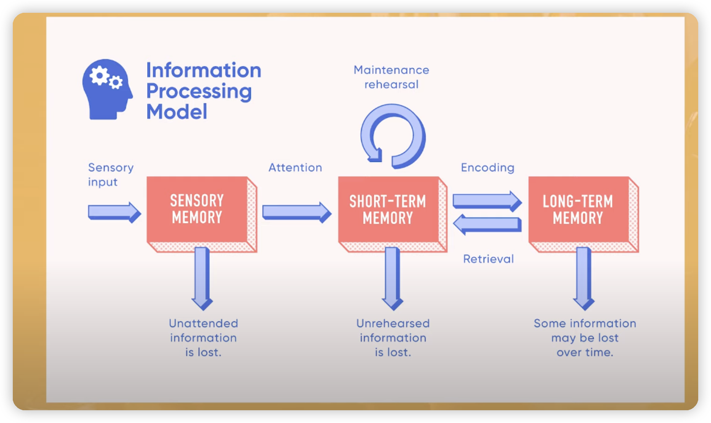
- 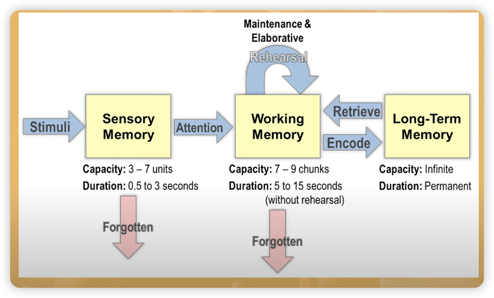{:height 217, :width 347}
- 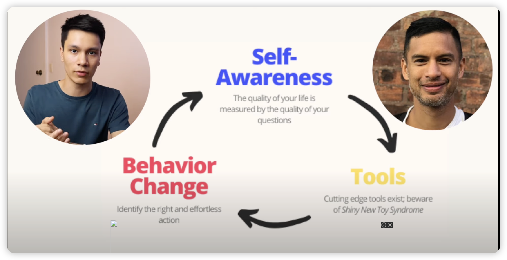
- Any isolated information isn't learnt efficiency
- https://youtu.be/3znAl0QH1eE?t=402when information has more places to belong, with more relationships you retain it
- 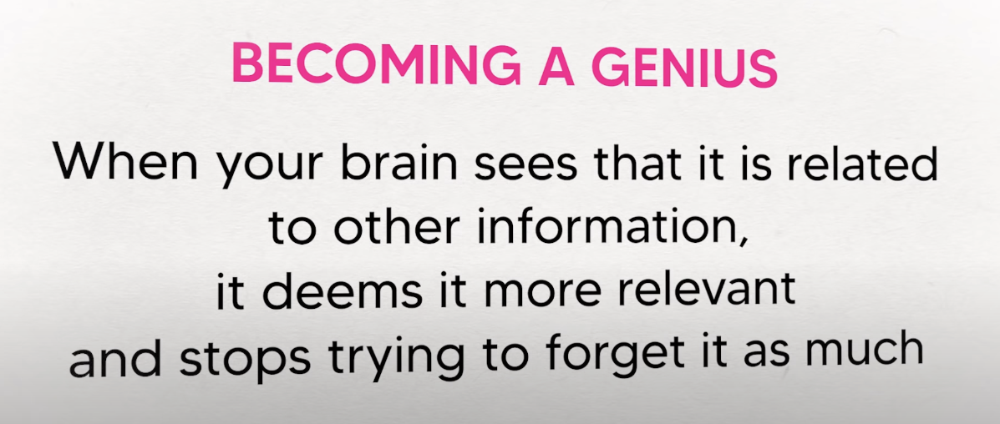
-
- combine,group,create relation based and group well mind map
- Judging  group and relation
- 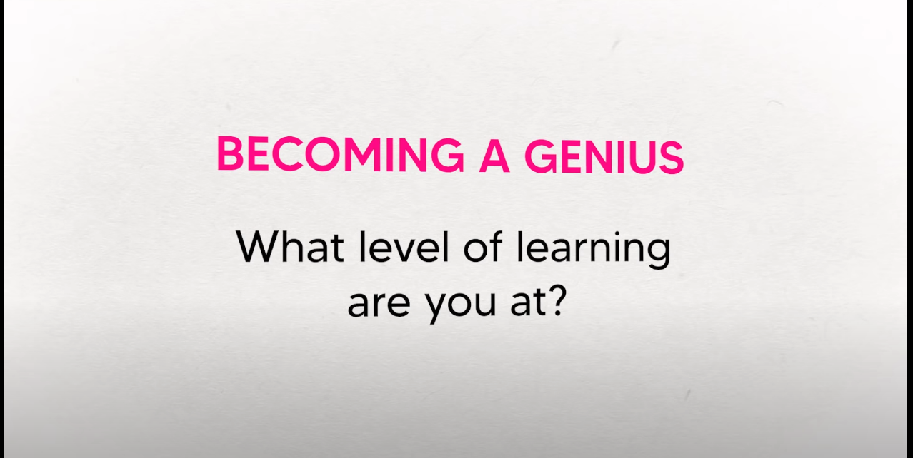
- 3 short term
	- up  level
	- Prestudy structure
	- Topic→3 or 4 of it → find relationship bettwen them→find sub idea of them and relation ship bettwen them
	- 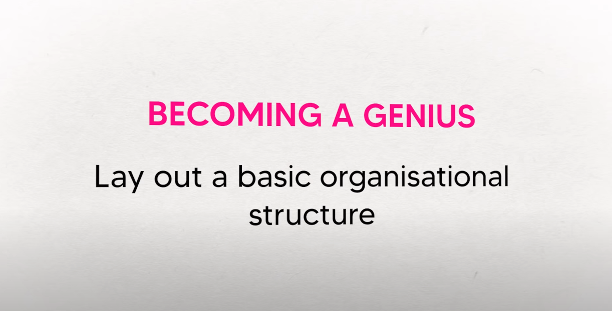{:height 257, :width 489}
	- delayed note-taking
- 2 long-term
	- cognitive load to tolerance
	- the brain is like a muscle you could train it
	- critical reflection of
- 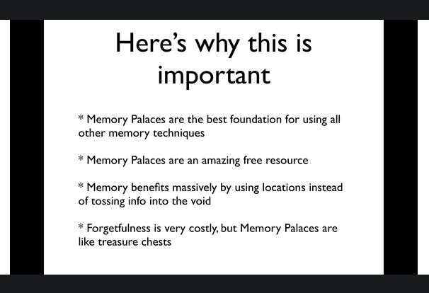
- 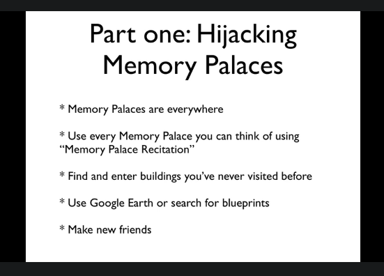{:height 404, :width 551}
- 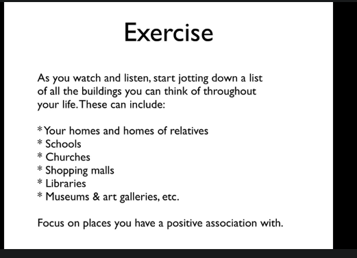
- 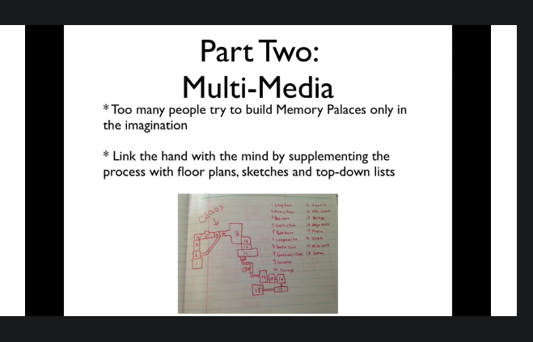{:height 431, :width 659}
- 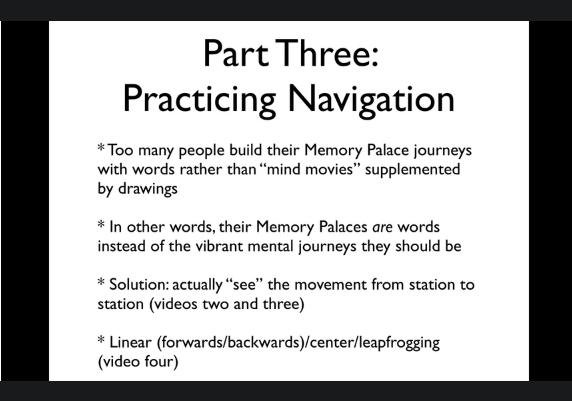
-