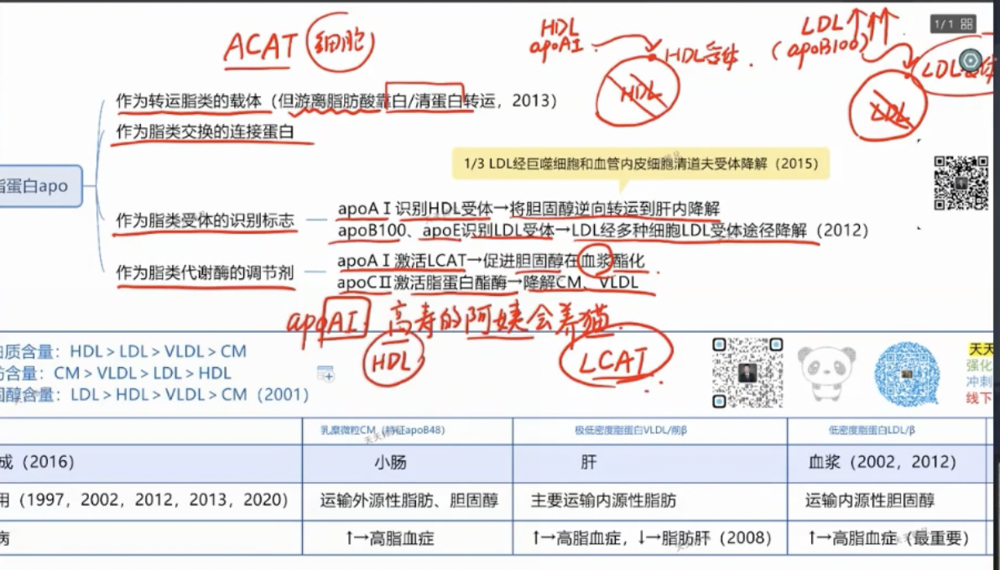

title:: 生物化学/activeRecall

- 糖代谢
  collapsed:: true
	- 无氧氧化
		- 糖酵解与无氧氧化的区别是?
		  background-color:: #497d46
		- 人体内己糖激酶同工酶有几型?肝内的为第几型?
		  background-color:: #978626
		- 磷酸果糖激酶-1的变构激活剂包括?最强的变构激活剂是?
		  background-color:: #978626
		- [[磷酸果糖激酶-1的别构抑制剂包括?]]
		  background-color:: #793e3e
		- 成熟红细胞中只能进行哪些代谢活动?成熟红细胞是否有其他细胞器?
		  background-color:: #497d46
	- 有氧氧化
	  id:: 62a2c6eb-9459-4fc8-8373-706f77913a31
		- [[丙酮酸脱氢酶复合体的辅因子包括?如何记忆?]]
		  background-color:: #793e3e
		- 什么是泛酸?与丙酮酸脱氢酶复合体有什么关系?
		  background-color:: #793e3e
		- [[琥珀酰CoA底物水平磷酸化生成琥珀酸时产生的高能化合物是?]]
		  background-color:: #793e3e
		- [[ATP供能见于?]]
		- [[GTP供能见于?]]
		  background-color:: #793e3e
		- [[CTP供能见于?]]
		  background-color:: #978626
		- [[UTP供能见于?]]
		  background-color:: #793e3e
		- 三羧酸循环中哪个反应脱氢经FAD所传递?
		  background-color:: #497d46
		- 糖有氧氧化各阶段酶的调节机制包括?
		- 己糖激酶的调节剂包括?其是否受到ADP/AMP的调控?
		  background-color:: #793e3e
		- [[葡糖激酶与葡糖-6-磷酸与胰岛素的关系?]]
		- 丙酮酸脱氢酶复合体是否为关键酶?与ADP/AMP是否有关系?
		- 从丙酮酸到完整三羧酸循环产生多少ATP?
		- 由丙酮酸到乙酰CoA的产物是什么?
	- 磷酸戊糖途径
		- 联系核苷酸代谢与磷酸戊糖途径的物质是?
		- 葡萄6-磷酸磷酸戊糖途径第一阶段的代谢产物是?
		- 糖,脂,氨基酸代谢的枢纽是什么?
	- 糖异生
	  id:: 62a1a3bd-4f3d-4d03-b868-bc3524ca770e
		- [[生酮氨基酸的口诀是?]]
		- [[生酮兼生糖氨基酸的口诀是?]]
		- 肝糖原耗尽时间?
		  background-color:: #497d46
		- 为什么肝糖原耗尽后血糖依然能够维持在正常范围?
		  background-color:: #497d46
		- 乳酸与一些生糖氨基酸均是通过哪条途径糖异生的?
		  background-color:: #497d46
		- 丙酮酸如何变为磷酸烯醇式丙酮酸?需要的酶是?消耗的能量为?
		  background-color:: #497d46
		- 丙酮酸必须在何处转变为草酰乙酸?为什么?
		  background-color:: #497d46
		- [[草酰乙酸在何处转变为磷酸烯醇式丙酮酸]]?
		  background-color:: #497d46
		- 草酰乙酸转运出线粒体两种方式的差别?
		  background-color:: #497d46
		- 草酰乙酸转运方式的选择主要取决于?
		  background-color:: #497d46
		- 由乳酸糖异生和由丙酮酸或生糖氨基酸糖异生的转运方式分别是?
		  background-color:: #978626
		- 丙酮酸或生糖氨基酸糖异生需要的NADH由谁提供?
		  background-color:: #497d46
		- 糖异生与糖酵解的反向调节主要是针对哪两个底物循环?
		  background-color:: #497d46
		- 第一个底物循环的调节剂包括?其调节作用是?
		- 果糖2,6-二磷酸的意义?其与胰高血糖素与胰岛素的关系是通过何酶作用?如何调节酶的活性?
		  background-color:: #497d46
		- 第二个底物循环是什么?
		  background-color:: #497d46
		- 第二个底物循环涉及哪些关键酶?
		- 丙酮酸激酶受何种调节?
			- 别构激活剂是什么?
			  background-color:: #497d46
			- 丙酮酸激酶与胰高血糖素之间的关系?通过何来联系?
			  background-color:: #497d46
			- 别构抑制剂是什么?
			  background-color:: #978626
			- 还可受到何种化学调节?
			  background-color:: #978626
		- 乙酰CoA的别构作用包括?
		  background-color:: #978626
		- 丙酮酸羧化酶与丙酮酸脱氢酶复合体的别构调节?
		  background-color:: #978626
		- 磷酸烯醇式丙酮酸羧激酶的独特调节机制是?
		  background-color:: #978626
		- 果糖1,6-二磷酸的调节作用包括?
		  background-color:: #978626
		- 胰高血糖素的作用是?
		  background-color:: #497d46
		- 两个底物循环之间的联系?
		  background-color:: #497d46
		- 糖异生的生理意义包括?
		  background-color:: #497d46
		- 饥饿时糖异生的主要原料是?
		  background-color:: #497d46
		- 饥饿时血糖补给的主要来源是?
		  background-color:: #497d46
		- 乳酸主要产生于何处又在何处进行糖异生?为什么?
		  background-color:: #497d46
		- 乳酸循环的意义是什么?
		  background-color:: #497d46
		- 2分子乳酸异生成葡萄糖需要消耗多少能量?
		  background-color:: #978626
		- 饥饿后进食肝脏恢复肝糖原储备的重要途径是?其优势在于?被称为何种途径?
		  background-color:: #497d46
		- 为什么肝摄取葡萄糖的能力低但仍可合成糖原?为什么进食2-3小时肝仍然要保持较高的糖异生活性?
		  background-color:: #497d46
		- 为什么长期饥饿时肾的糖异生作用增强?刺激物是什么?通过何者变化来加强?
		  background-color:: #497d46
		-
		-
		-
	- 血糖调节
	  id:: 62a1ec0a-dcdb-4d7a-8dd8-e935309c9fa4
		- 血糖稳态主要受何调节?
		- 胰岛素如何增加血糖的去路?
		- [[胰岛素如何降低血糖的来源?]]
		- 糖皮质激素如何升高血糖?
		  background-color:: #793e3e
		- 肾上腺素为什么能升高血糖?其生理意义主要是什么?
		- 什么是低血糖?
		- 什么是高血糖?
		- 糖尿病的诊断标准?
		- 雌激素与血糖有何关系?
- 脂质代谢
  id:: 62a2f8b2-2c18-4401-aec5-f79ae4fc45d9
  collapsed:: true
	- 酮体包括?
	- 酮体与胆固醇的合成原料?合成部位?亚细胞部位?
	- 酮体与胆固醇合成的关键酶是?
	- 酮体与胆固醇的作用是?
	- HMG生成乙酰乙酸与甲羟戊酸的酶分别是?
	- 2乙酰CoA与乙酰乙酰COA之间的转换由何酶催化?肝内肝外的作用不同是?
	- 酮体的特殊气味是?
	- 酮体的存在意义是什么?为什么需要酮体?
	- 酮体如何受激素调节?
	- 丙二酸单酰CoA与酮体的生成的关系?
	- 酮体利用的主要酶包括?
	- 以乙酰 CoA为合成原料的是?
	- 脂肪细胞与对于脂肪的作用?
	- 哪些细胞不能合成胆固醇?
	- 胆固醇合成的日节律是?
	- HMG-CoA只有别构..剂?
	- 每合成1分子胆固醇需要消耗多少东西?
	- [[甲亢]] 患者血清胆固醇如何变化?
	- [[甲状腺激素对胆固醇的影响?]]
	- 胆固醇的主要去路是?
	- 初级游离胆汁酸如何变为初级结合胆汁酸?
	- 初级结合胆汁酸如何变为次级游离胆汁酸?
	- 甘油三酯合成的亚细胞部位是?
	- [[极低密度脂蛋白的组成成分包括?]]
	- 营养不良,中毒与脂肪肝的关系?为什么?
	- 3磷酸甘油的主要来源?
	- 在肝和肾脏3-磷酸甘油可以来自?
	- 脂肪细胞的甘油三酯的来源是?
	- 甘油一酯途径的主要部位是?
	- 甘油二酯途径的主要部位是?
	- 甘油三酯合成的关键酶是?其分布部位是?
	- 一分子脂肪酸活化为酯酰CoA需要消耗多少能量?
	- 甘油一酯途径的起始物是?甘油二酯途径的起始物是?
	- 甘油一二酯途径的终末产物都是?
	- 小肠黏膜细胞进食和空腹后的合成途径分别是?
	- 糖分解代谢产物乙酰CoA位于?
	- 软脂酸的合成位于何处?
	- 乙 酰CoA如何出线粒体?
	- 软脂酸需要何缩合而成?
	- 乙酰CoA如何转化为丙二酸单酰CoA,需要消耗?
	- 软脂酸的合成需要经过几次循环?循环反应是什么?每次循环加就几个碳,软脂酸一共有多少碳?
	- 脂肪酸合成酶只能合成?更长的脂肪酸需要在何基础上合成?其延长的亚细胞部位是?
	- 内质网的脂肪酸延长供碳单位是?供氢单位是?反应循环是?最长延长至多少碳?以多少碳为主?
	- 线粒体脂肪酸延长的供碳单位是?反应循环是?一般可延长至?
	- [[哪些途径可以提供NADPH?]]
	- 柠檬酸-丙酮酸循环的过程中哪一步生成NADPH?b
	- 人体内的不饱和脂肪酸包括?其中必须不饱和脂肪包括?最重要的必须脂肪酸是?
	- 脂肪动员的第一步反应由何酶催化?生成?
	- 脂肪动员的第二步反应由何催化?生成?
	- 第三步反应由何催化?
	- 为什么HSL叫做激素敏感性甘油三酯脂肪酶?哪些是抗脂解激素?
	- 甘油需要以何种形式才能被利用?其所需的酶为?
	- 甘油主要在何处利用,为什么?
	- 脂肪酸的活化与利用部位?
	- 脂肪酸的活化所需要何种酶?其部位是?
	- 脂肪酸无论是合成甘油三酯或是氧化分解均需要?其关键酶是?
	- 长链脂酰CoA如何通过进入线粒体?
	- 一次β氧化的四步骤是?
	- β氧化第一次脱氢与第二次脱氢分别由何接受?
	- [[2n个碳原子的脂肪酸生成多少个ATP?]]
	- 不饱和脂肪酸为什么不能直接β氧化?
	- 超长链的脂肪酸的氧化需在何处进行?其氧化的产物是?氧化第一步生成的氢被何接受?生成何?
	- 奇数碳原子脂肪酸的氧化残余为? 其需要如何才能彻底氧化?
	- 脂肪酸ω氧化为什么能起作用?
	- 脂肪酸的合成与分解的关键酶是?重要中间代谢产物是?硫酯键是?电子传递辅酶是?是否需要HCO₃⁻?
	- 多不饱和脂肪酸的主要衍生物包括?
	- 为什么PGI₂要称为前列环素?
	- PGI,E₂的主要作用是什么?
	- TXA₂与PGI₂的关系?
	- 白三烯与组胺,PGF2α的支气管收缩作用?
	- 描述甘油磷脂的结构通式?
	- 甘油的组成成分包括?
	- 甘油磷脂的二位脂肪酸为?必须由?
	- 胆碱与丝氨酸的关系?
	- 甘油二酯途径合成磷脂时胆碱与乙醇胺的活化形式?
	- CDP-甘油二酯途径时肌醇,丝氨酸是否需要活化?
	- 1,2甘油二酯与CDP-甘油二酯的共同前体是?
	- 含有胆碱的磷脂是?
	- 磷脂酶A12,CD的底物都是?
	- 磷脂酶A1,2的产物是?
	- 磷脂酶B1,2水解的底物是?
	- 神经鞘磷脂酶的存在部位?
	- 电泳分类从正极到负极的排序是?
	- 超速离心法蛋白质的分类??及其与电泳对应的顺序?
	- CM,VLDL.LDL的含甘油三酯量为?
	- CM,VLDL.LDL的合成部位是?
	- CM,VLDL,LDL的作用是?
	- 空腹多久后血浆不含CM?
	- 为什么需要高密度脂蛋白?
	- 可被巨噬细胞吞噬的脂蛋白是?
	- 由肝脏合成的脂蛋白包括?
	- 
- 蛋白质
  collapsed:: true
	- 决定蛋白质营养价值的是?
	  background-color:: #497d46
	- 什么是蛋白质的营养价值?
	  background-color:: #497d46
	- 必须氨基酸包括?
	  background-color:: #497d46
	- 人体内有多种组成蛋白质的氨基酸?
	  background-color:: #497d46
	- 什么叫食物蛋白质的互补作用?
	  background-color:: #497d46
	- 蛋白质在胃被消化为?
	  background-color:: #497d46
	- 蛋白质在小肠被消化为?
	  background-color:: #497d46
	- 小肠内消化蛋白质的内肽酶包括?
	  background-color:: #978626
	- 水解碱性氨基酸残基的酶是?
	  background-color:: #978626
	- 水碱芳香族氨基酸残基的酶是?
	  background-color:: #978626
	- 水解脂肪族氨基酸残基的酶是?
	  background-color:: #978626
	- 外肽酶包括?
	  background-color:: #497d46
	- 胰液中主要的外肽酶是?
	  background-color:: #497d46
	- 胰蛋白酶原的激活物是?
	  background-color:: #497d46
	- 胰凝乳蛋白酶原,弹性蛋白酶原,羧肽酶原的激活物是?
	  background-color:: #497d46
	- 胰凝乳蛋白酶原又名?
	  background-color:: #497d46
	- 寡肽与多肽的区别?
	  background-color:: #497d46
	- 蛋白质在小肠的消化产物及比例?
	  background-color:: #497d46
	- 寡肽的水解部位?
	  background-color:: #497d46
	- 描述蛋白质降解的途径?
	  background-color:: #497d46
	- 溶酶体降解蛋白质的特点?
	  background-color:: #497d46
	- 什么叫做泛素化,其意义是什么?
	  background-color:: #497d46
	- 蛋白酶体降解蛋白质与溶酶体降解蛋白质有何不同?
	  background-color:: #497d46
	- 蛋白酶体存在的部位及其主要降解何种蛋白质?
	  background-color:: #497d46
	- 氨基酸代谢库最大的部位是?
	  background-color:: #497d46
	- 氨基酸分解代谢首先是?
	  background-color:: #497d46
	- [[氨基酸有哪些脱氨基的方式?]]
	  background-color:: #497d46
	- 转氨酶的底物是什么,产物是什么?
	  background-color:: #497d46
	- [[哪些氨基酸不能通过转氨基脱氨?]]
	  background-color:: #978626
	  id:: 62a700cd-bdda-49a9-a4a5-2ac60e6595a1
	- [[只有α氨基才能脱氨基吗?]]
	  background-color:: #497d46
	- ALT与AST谁是谷丙转氨酶谁是谷草转氨酶?
	  background-color:: #497d46
	- ALT的底物是什么,产物是什么?
	  background-color:: #497d46
	- AST的底物是什么,产物是什么?
	  background-color:: #978626
	- ALT的活性在何处最高?AST的活性在何处最高?所以当其部位发生病变时会出现何种表现?
	  background-color:: #497d46
	- [[氨基转移酶具有相同的辅酶,其是什么?]]
	  background-color:: #497d46
	- 在转氨基反应的过程中传递氨基的物质是?
	  background-color:: #497d46
	- 哺乳动物体内唯一能以相当高速度进行氧化脱氨基的氨基酸是?其酶为?
	  background-color:: #497d46
	- 什么叫做联合脱氨作用?
	  background-color:: #497d46
	- 氨基酸氧化酶的辅基是什么?其产生的氨是何种形式?其与过氧化氢酶有何联系?
	  background-color:: #978626
	- 氨基酸脱氨基后可以有哪些去路?
	  background-color:: #497d46
	- 生酮氨基酸?生糖生酮氨基酸?
	  background-color:: #497d46
	- 生糖氨基酸的中间产物是?
	  background-color:: #497d46
	- 生酮氨基酸的中间代谢产物是?
	  background-color:: #497d46
	- 血氨的主要来源包括?
	  background-color:: #497d46
	- 血氨的来源途径包括?
	  background-color:: #497d46
	- [[肠道产生的氨可以来自哪些物质?]]
	  background-color:: #497d46
	- 肾小管上皮细胞分泌的氨来自于?
	  background-color:: #497d46
	- 小管液中的氨何时进入血液?
	  background-color:: #497d46
	- 氨为什么需要以无毒的方式在血液中转运?
	  background-color:: #497d46
	- 氨在血液中以何形式转运?
	  background-color:: #497d46
	- 氨的排出形式包括?
	  background-color:: #497d46
	- 骨骼肌细胞主要如何将氨运往肝?
	  background-color:: #497d46
	- 脑和骨骼肌如何运氨?这种运输方式可以将氨运往?
	  background-color:: #497d46
	- 谷氨酰胺合成酶需要能量吗?
	  background-color:: #978626
	- 谷氨酸如何变为谷氨酰胺?
	  background-color:: #497d46
	- 临床上对于氨中毒的病人可以采用何种药物治疗?
	  background-color:: #497d46
	- 氨的主要代谢去路是?比例是多少?
	  background-color:: #497d46
	- 鸟氨酸瓜氨酸精氨酸三者的关系?精氨酸与鸟氨酸的区别是?
	  background-color:: #497d46
	- 尿素合成的起始物是?催化其合成的酶是?其发挥作用需要在哪些因子的作用下?此反应消耗多少能量?
	  background-color:: #978626
	- OCT鸟氨酸氨基甲酰转移酶催化的底物即生成的产物是?此反应发生的部位?
	  background-color:: #978626
	- 瓜氨酸的生成部位是?其如何转变为精氨酸代琥珀酸?
	  background-color:: #497d46
	- 尿素的第二个氮原子由谁提供?'
	  background-color:: #497d46
	- 精氨酸代琥珀酸可以裂解为?
	  background-color:: #978626
	  id:: 62a717b8-9291-4964-963d-5e8b26fc95cc
	- 精氨酸在精氨酸酶的催化下生成?
	  background-color:: #497d46
	- 尿素合成需要消耗几个ATP,几个高能磷酸键?分别在哪些步骤消耗?
	  background-color:: #978626
	  id:: 62a7186c-da3d-4200-8ce3-f9e699bd434b
	- 尿素合成受哪些因素调节?
	  background-color:: #497d46
	- 尿素合成与食物蛋白的关系?
	  background-color:: #497d46
	- 尿速合成的关键酶有?
	  background-color:: #497d46
	- AGA由何合成?其酶为?其酶受何调节?
	  background-color:: #978626
	- 尿素循环中酶活性最低的是?
	  background-color:: #497d46
	- 脑中氨增多如何影响三羧酸循环?
	  background-color:: #497d46
	- 氨如何使脑渗透压增大引起症状?
	  background-color:: #497d46
	- 氨基酸脱缩生成?酶为?酶的辅酶是?
	  background-color:: #497d46
	- 谷氨酸的脱羧生成?
	  background-color:: #497d46
	- 什么是一碳单位?包括?
	  background-color:: #497d46
	- 一碳单位需要与谁结合而参与代谢,为什么?
	  background-color:: #497d46
	- 叶酸如何变为四氢叶酸?需要哪些酶?
	  background-color:: #497d46
	- 哪些氨基酸可以生成一碳单位?
	  background-color:: #978626
	- [[四氢叶酸与四氢生物蝶呤的区别?及各自作用?]]
	  background-color:: #978626
	  id:: 62a81684-12af-48a8-b32d-46ff3ad2957a
	- 四氢叶酸的N5结合?
	  background-color:: #978626
	  id:: 62a72f23-fcda-4bd2-a6e4-3be7bb0f5eea
	- N5和N10结合?
	  background-color:: #497d46
	- N5或N10结合?
	  background-color:: #978626
	  id:: 62a813a2-54f6-43b9-aeac-66c6e908831c
	- 四氢叶酸之间如何相互转变?何种四氢叶酸不能发生转变?
	  background-color:: #497d46
	- 一碳单位的主要功能是?
	  background-color:: #497d46
	- 氨基酸代谢与核苷酸代谢由谁联系起来?
	  background-color:: #497d46
	- 一碳单位的代谢障碍或FH4合成不足时将导致何种疾病?
	  background-color:: #497d46
	- 磺胺类药物的作用机制?
	  background-color:: #497d46
	- 甲氨蝶呤的抗肿瘤作用表现为?
	  background-color:: #497d46
	- 含硫氨基酸包括?其中何为必须氨基酸?之间能发生何种转化?
	  background-color:: #497d46
	- 甲硫氨酸中的甲基如何活化?其活化形式为?
	  background-color:: #497d46
	- SAM失去甲基后的产物为?
	  background-color:: #978626
	- 为什么同型半胱氨酸加甲基后生成甲硫氨酸而后者仍然为必须氨基酸?此反应由何生成?其辅酶是?
	  background-color:: #497d46
	- VitB12缺乏为什么能引起巨幼贫?
	  background-color:: #978626
	- 为什么将N5-CH3-FH4称为体内甲基的间接供体?为什么其聚集会影响四氢叶酸的再生?
	  background-color:: #978626
	- 肌酸生成与鸟氨酸循环有何关系?甲硫氨酸循环有何关系?
	  background-color:: #978626
	  id:: 62a8155f-3833-4e26-b7fd-9c25b2fa0e9a
	- 脒基的化学式为?与尿素的关系为?
	  background-color:: #978626
	- 肌酸的骨架由谁提供?脒基由谁提供?甲基由谁提供?
	  background-color:: #978626
	  id:: 62a738af-80a8-4425-9e2f-0749437976f3
	- 肌酸激酶的意义是?其分为几种同工酶?脑心肌分别是何种同工酶?
	  background-color:: #497d46
	- 内生肌酐清除率中的肌酐与肌酸与磷酸肌酸有何关联?
	  background-color:: #497d46
	- 体内硫酸根的主要来源是?硫酸根在生物转化中有何作用?
	  background-color:: #497d46
	- 芳香族氨基酸
		- 芳香族氨基酸的代谢需要什么催化?
		  background-color:: #978626
		- 芳香族氨基酸包括?
		  background-color:: #978626
		- 酪氨酸与苯丙氨酸的关系?
		  background-color:: #497d46
		- 苯丙氨酸的去路有?当苯丙氨酸羟化酶缺陷将会导致?
		  background-color:: #497d46
		- 苯丙氨酸羟化酶与酪氨酸羟化酶的辅酶是?
		  background-color:: #978626
			- {{embed ((62a81684-12af-48a8-b32d-46ff3ad2957a))}}
		- 苯丙氨酸如何变为苯丙酮酸?
		  background-color:: #978626
		  id:: 62a815ef-780c-4318-b4f8-07881f272ab2
		- 酪氨酸,多巴,多巴胺,去甲肾上腺素,肾上腺素的关系?
		  background-color:: #978626
		- 合成儿茶酚胺的关键酶是?
		  background-color:: #497d46
		- 黑色素,多巴,酪氨酸的关系?
		  background-color:: #978626
		  id:: 62a7430c-2d28-45c0-b822-d06ef0caf2c0
		- 为什么苯丙氨酸与酪氨酸为生糖兼生酮氨基酸?
		  background-color:: #978626
		- 尿黑酸与酪氨酸的关系是?
		  background-color:: #978626
		- 色氨酸的代谢产物包括?
		  background-color:: #978626
		  id:: 62a734fd-c780-4a00-806f-203b9a6deebc
		- 酪氨酸转化为多巴可以在哪些酶的催化下?这些酶的后续最终产物是?
		  background-color:: #978626
		- 苯丙酮酸与羟苯丙酮酸分别由何产生?酶为?'
		  background-color:: #978626
		-
- 核苷酸
  collapsed:: true
	- 嘌呤核苷酸的合成与分解
		- 什么叫做从头合成?什么叫做补救合成?
		  background-color:: #497d46
		- 从头合成与补救合成的主要器官部位?
		  background-color:: #978626
		- 从头合成的亚细胞部位?
		  background-color:: #978626
		- 合成分为两个阶段,首先合成?
		  background-color:: #497d46
		- 嘌呤核苷酸的合成是在何基础上完成的?
		  background-color:: #497d46
		- IMP合成AMP需要消耗ATP还是GTP?
		  background-color:: #497d46
		- 嘌呤核苷酸的从头合成需要什么提供磷酸核糖?
		  background-color:: #497d46
		- 嘌呤核苷酸的从头合成需要哪些原料?
		  background-color:: #978626
		- 从头合成的关键反应步骤是?底物与产物分别是?酶是?
		  background-color:: #793e3e
		  id:: 62a87458-395a-4045-b09a-1267735ee500
		- [[补救合成包括哪两种方式?]]
		  background-color:: #978626
		- 体内仅存在哪种嘌呤核苷能通过激酶的合成
		  background-color:: #978626
		- 补救合成具有哪些意义?
		  background-color:: #978626
		- [[若基因缺陷导致HGRPT完全缺失患者表现为?]]
		  background-color:: #978626
		- AMP与GMP通过何相互转换?
		  background-color:: #978626
		- 脱氧核苷酸为什么叫做脱氧核苷酸?其与核糖核苷酸相比差别在于?
		  background-color:: #978626
		- 脱氧核苷酸由何而来,其与核糖核苷酸有何关系?催化反应的酶是?
		  background-color:: #978626
		- dTMP和dUMP之间的关系,该反应发生在何水平,由何得到?
		  background-color:: #978626
		- 嘌呤核苷酸的抗代谢物包括哪些类型?
		  background-color:: #497d46
		- 6-MP结构与何相似从而抑制代谢?
		  background-color:: #978626
		- 描述6-MP抑制从头合成的机制?其抑制哪步反应哪个酶?
		  background-color:: #978626
		- 6-MP抑制补救合成的机制?
		  background-color:: #978626
		- 氨基酸类似物的干扰嘌呤核苷酸代谢的机制?
		  background-color:: #978626
		  id:: 62a86716-82f0-4b0b-b067-381bd96ed3a7
		- 氨蝶呤与甲氨蝶呤的抑制机制?
		  background-color:: #497d46
		- AMP如何转变为黄嘌呤?
		  background-color:: #497d46
		- GMP如何转变为黄嘌呤?
		  background-color:: #497d46
		- 黄嘌呤与尿酸的关系?
		  background-color:: #497d46
		- 别嘌呤醇与何类似?
		  background-color:: #978626
		- 别嘌呤醇如何抑制尿酸的生成?
		  background-color:: #978626
		- 别嘌呤通过哪些作用降低嘌呤核苷酸的从头合成?
		  background-color:: #978626
		- 比较6-MP与别嘌呤醇的作用?
		  background-color:: #978626
	- 嘧啶核苷酸的合成与分解
		- 嘧啶核苷酸有哪些合成途径?
		  background-color:: #497d46
		- 与嘌呤的从头合成有何差别?
		  background-color:: #497d46
		- 嘧啶核苷酸的合成的原料有哪些?与嘌呤相比?
		  background-color:: #497d46
		- 嘧啶核苷酸合成的亚细胞部位?与嘌呤相比?
		  background-color:: #978626
		- 嘧啶核苷酸的合成起始物是?
		  background-color:: #978626
		- 尿素合成过程的起始物与嘧啶核苷酸有何异同?
		  background-color:: #978626
		- 嘧啶从头合成关键是具有嘧啶环的?
		  background-color:: #978626
		- 尿嘧啶由何生成?
		  background-color:: #978626
		- 尿嘧啶.胞嘧啶,胸腺嘧啶三者的关系?
		  background-color:: #497d46
		- 真核生物合成嘧啶核苷酸的前三个酶有何关系?后两个酶有何关系?这种关系的意义是什么?
		  background-color:: #978626
		- CTP的合成的底物是?需要消耗?
		  background-color:: #978626
		- 也就是说合成CTP需要UMP变为?
		  background-color:: #497d46
		- [[而dCMP与dUMP之间有何种关系?]]
		  background-color:: #978626
		- UMP与dUMP之间的关系的桥粱即中间产物是?
		  background-color:: #978626
		- dUMP与TMP转变需要经过何种反应?此反应的供体为?在此反应中dUMP可以来自于哪些途径,主要途径为?
		  background-color:: #978626
		  id:: 62a878d1-028c-436b-9c6b-10e577b75591
		- 从头合成的调节过程中细菌主要调控的酶是?哺乳动物主要调控的酶是?后者受何抑制?
		  background-color:: #793e3e
		  id:: 62a87933-c368-44d3-b156-dd7c6c419b68
		- PRPP合成酶可以受哪些因素调控?
		  background-color:: #978626
		- 嘧啶核苷酸的补救合成需要何酶催化?这种酶 的底物包括?此酶对何不起作用?
		  background-color:: #978626
		  id:: 62a87c48-a8fe-4226-84b5-0de8ebc5fae8
		- 嘧啶的类似物主要是?其结构与何相似?
		  background-color:: #978626
		  id:: 62a87cd4-1c67-40a4-9450-59f3622e811b
		- 5-FU的的活性形式包括?分别抑制哪些反应?
		  background-color:: #978626
		  id:: 62a87d09-187d-4027-9a26-c1882a138149
		- [[阿糖胞苷的作用机制是?]]
		  background-color:: #978626
		- 嘧啶核苷酸通过何种酶除去磷酸?
		  background-color:: #497d46
		- 嘧啶核苷酸通过何种酶除去核糖?
		  background-color:: #497d46
		- 胞嘧啶如何变为尿嘧啶?
		  background-color:: #978626
		- 尿嘧啶最终生成?
		  background-color:: #978626
		- 胸腺嘧啶最终生成?
		  background-color:: #978626
		- 请描述上述二者的化学式?
		  background-color:: #978626
		- 二者谁的代谢产物可以进行糖异生?通过哪一中间物质参与糖异生?
		  background-color:: #978626
		-
		-
		-
	- 小结
	  collapsed:: true
		- 体内的核苷酸的主要来源是?
		  background-color:: #497d46
		- [[核苷及碱基的吸收方式?]]
		  background-color:: #497d46
		- CO₂在嘌呤与嘧啶的合成过程中的作用差异?
		- [[关于一碳单位在甲硫氨酸循环,嘌呤核苷酸合成,dTMP合成中的具体供碳?]]
		  background-color:: #497d46
- 代谢的整合与调节
  collapsed:: true
	- [[脂肪分解增强使得ATP增加,相应的葡萄糖代谢如何改变?]]
	  background-color:: #978626
	- [[葡萄糖分解增加使得ATP增多如何影响脂肪代谢?]]
	  background-color:: #978626
	- [[乙酰CoA变为丙二酸单酰CoA需要何酶催化?此酶的激活剂为?]]
	  background-color:: #978626
	- 脂肪分解产生的乙酰CoA能否变为丙酮酸重新糖异生?
	  background-color:: #978626
	- 脂肪分解产物甘油与脂肪酸可否异生为葡萄糖?
	  background-color:: #978626
	- [[饥饿,糖供给不足或糖代谢障碍时如何影响酮体转化能量?]]
	  background-color:: #978626
	- 丝氨酸,乙醇胺,胆碱之间的相互关系及其与丝氨酸磷脂,脑磷脂,卵磷脂之间的关系?
	  background-color:: #978626
	- 脂肪酸合成与分解的关键酶分别是?
	  background-color:: #978626
	  id:: 62a88e74-efa1-405b-ac4f-4c0e0b85fed9
	- 代谢调节按速度可以分为?前者包括,后者为?
	  background-color:: #978626
	- 别构调节作用的产生机制?
	  background-color:: #978626
	- 葡萄-6-磷酸对于糖原合酶与糖原磷酸化酶有何作用不同?
	  background-color:: #497d46
	- [[酶的化学修饰包括哪些调节方式?其中以哪种最为常见?]]
	  background-color:: #978626
	- [[酶蛋白分子磷酸化修饰的位点是?]]
	  background-color:: #978626
	- 人体摄入高糖膳食后,胰岛素与胰高血糖素含量的变化?葡萄糖的去路如何?
	  background-color:: #978626
	- 人体摄入高蛋白饮食后胰岛素与胰高血糖素的含量变化?如何维持血糖?氨基酸的去路?
	  background-color:: #978626
	- 人体摄入高脂膳食后体内胰岛素与胰高血糖素如何变化?血糖如何维持,脂肪的去路包括?
	  background-color:: #978626
	- 空腹是指餐后多少小时?
	  background-color:: #978626
	- 空腹机体的代谢特征为?
	  background-color:: #978626
	- 饥饿时机体的代谢特征?
	  background-color:: #978626
	- 短期饥饿与长期饥饿时蛋白质分解如何变化?糖异生如何变化?长期饥饿晚期肾脏的作用?
	  background-color:: #978626
	- [[应激状态下哪些激素升高哪些激素减少?]]
	  background-color:: #497d46
	- 肝对于酮体与脂肪的代谢具有何种特点?
	  background-color:: #497d46
	- 脑的主要能量物质包括?
	  background-color:: #497d46
	- [[脑的脱氨基作用的由谁催化?]]与氨基酸脱氨基有何不同?
	  background-color:: #978626
	- [[心肌优先使用哪种能源物质进行供能?]]为什么?
	  background-color:: #978626
	- [[心肌主要通过哪些途径获得能量?]]
	  background-color:: #978626
	- 乳酸脱氢酶的作用包括?
	  background-color:: #978626
	- [[骨骼肌以何为主要来源?]]
	  background-color:: #978626
	- 肾可以进行哪些代谢?
	  background-color:: #978626
	  id:: 62a899fa-a3e2-4b5a-a9d3-044499a2c78f
	- 肾髓质主要靠何供能?为什么?肾皮质主要靠谁供能?
	  background-color:: #978626
	- [[脂肪酸在哪些部位为主要供能物质?]]
	  background-color:: #978626
	-
- DNA的合成
  collapsed:: true
	- 生物体内进行的DNA合成包括?
	  background-color:: #793e3e
	- DNA复制的特征包括?
	  background-color:: #497d46
	- 原核生物的基因组特点?其复制的特点是?
	- 真核生物的染色体复制特点是?
	- DNA聚合酶具有何种特性?
	  background-color:: #978626
	- 前导链与后随链的区别?
	  background-color:: #497d46
	- [[复制的保真性由哪些机制确保?]]
	  background-color:: #497d46
	- DNA的聚合反应中,哪两个基团相连形成酯键?
	  background-color:: #978626
	- [[原核生物DNA polⅡ的作用是?]]
	  background-color:: #978626
	- 原核生物 DNA pol Ⅰ,Ⅱ,Ⅲ具有何种活性?
	  background-color:: #978626
	- 原核生物DNA pol Ⅳ,Ⅴ具有何种作用?
	  background-color:: #793e3e
	- 原核生物的复制合成过程中真正起作用的酶是?
	  background-color:: #497d46
	- 原核生物DNA pol Ⅲ的核心酶是?
		- 其核心酶具有什么作用?
		  background-color:: #497d46
		- 核心酶中α,ε,θ分别具有何种作用?
		  background-color:: #497d46
		- DNA合成保真性依赖于何亚基?
		  id:: 62a9a338-1cf0-4000-a057-c891c7c538a9
		  background-color:: #497d46
		- β亚基具有何作用?
		  background-color:: #497d46
		- 什么是γ-复合物?其作用是?
		  background-color:: #978626
	- 原核生物DNA pol Ⅰ在活细胞的功能主要是?
	  background-color:: #978626
	  id:: 62a9a453-fb11-4cd7-8298-30fb5b2febd0
	- 原核生物DNA pol Ⅰ被水解后小片段具有何酶活性?大片段Klenow片段具有合酶活性?
	  background-color:: #978626
	  id:: 62a9a507-a1b0-417c-a1ec-9dcbe4830084
	- 真核生物DNA pol α的作用是?与DnaG有何关系?
	  background-color:: #793e3e
	  id:: 62a9a636-2517-44c8-b9b1-ccc10dcb0fd4
	- 什么叫做聚合酶转换?
	  background-color:: #978626
	- pol δ与ε的作用是?
	  background-color:: #978626
	- pol β与γ的作用是?
	  background-color:: #978626
		- 混淆点:pol β与DnaB的作用
		  background-color:: #793e3e
		  id:: 62aab415-325d-4375-af53-96b452df8060
	- 碱基的复制与配对的关键在于?
	  background-color:: #497d46
	- 原核生物DNA pol Ⅲ碱基选择功能依赖何亚基执行?
	  background-color:: #497d46
	  {{embed ((62a9a338-1cf0-4000-a057-c891c7c538a9))}}
	- 错配修复可以由哪些酶修复?
	  background-color:: #793e3e
	  id:: 62a9a117-a0ef-4001-9023-f878a800993b
	- DNA pol Ⅰ还有哪些酶活性?其意义是什么?
		- ((62a9a453-fb11-4cd7-8298-30fb5b2febd0))
		- ((62a9a507-a1b0-417c-a1ec-9dcbe4830084))
	- 解链酶DnaA.B,C,G的作用分别是什么?
	  id:: 62a9b4c6-a5c3-44dc-a023-5a6dc0c21ae3
	  background-color:: #793e3e
	- SSB的作用是什么?意义是?
	  background-color:: #497d46
	- 蛋白质分子参与DNA复制的过程中在其前方形成何种超螺旋?后方呢?
	  background-color:: #497d46
	- 拓补异构酶Ⅰ与Ⅱ的作用机制有何不同?消耗有何不同?
	  background-color:: #497d46
	- DNA连接酶的的作用仅限于?
	  background-color:: #497d46
	- DNA连接酶可以在哪些阶段发挥作用?
	  background-color:: #497d46
	- 原核生物的DNA复制过程
		- 复制的起始过程包括哪些环节?
		  background-color:: #497d46
		- E. coli DNA的解链的起点是?起点富含何样结构有助于解链?
		  background-color:: #978626
		- ((62a9b4c6-a5c3-44dc-a023-5a6dc0c21ae3))
		- 解链酶与拓补异构酶的功能区别是什么?
		  background-color:: #793e3e
		- 为什么解链过程需要DNA拓补异构酶?其作用是形成何种超螺旋?为什么?
		  background-color:: #497d46
		- 为什么DNA合成需要引物?
		  background-color:: #497d46
		- 为什么引物得是RNA?
		  background-color:: #497d46
		- 利福平的作用靶点是什么?引物酶与RNA聚合酶有何不同?
		  background-color:: #978626
		- [[起始复合物结构包括哪些成分?]]
		  background-color:: #793e3e
		  id:: 62a9c28c-1737-4d98-9d6c-d5715c5b5304
		- 前导链与后随链顾名思义谁先复制?
		  background-color:: #497d46
		- 前导链与后随链方向相反但是为什么能用同一个聚合酶合成同时合成?
		  background-color:: #497d46
		- 冈崎片段之间是否需要RNA引物?
		  background-color:: #497d46
		- 引物的水解靠的是?为什么其能够水解引物?
		  background-color:: #497d46
		- 引物水解后的残缺部分靠谁填补?
		  background-color:: #497d46
		- 最后形成的空隙靠谁填补?
		  background-color:: #497d46
	- 真核生物的DNA复制过程
		- 真核生物的基因复制发生在细胞周期的哪一阶段?
		  background-color:: #497d46
		- 真核生物DNA复制的延长发生哪一过程?
		  background-color:: #497d46
		- 真核生物DNA合成后立即组装成?其材料可以来自于?
		  background-color:: #793e3e
		- 为什么染色体两端会逐渐变短?
		  background-color:: #497d46
		- [[DNA测序发现端粒结构的共同特点是?]]
		  background-color:: #793e3e
		- 线粒体DNA按何种方式复制?
		  background-color:: #497d46
		- 线粒体含有多少个基因?分别编码?
		  background-color:: #793e3e
	- 逆转录
		- RNA病毒的复制方式是?
		  background-color:: #497d46
		- 是否所有的RNA病毒都是逆转录病毒?
		  background-color:: #497d46
		- 单链RNA到双链DNA的生成可分为几步?
		  background-color:: #497d46
		- 逆转录酶包括哪些活性?
		  background-color:: #497d46
		- 逆转录酶的辅因子是?
		  background-color:: #793e3e
		-
- DNA损伤和损伤修复
  collapsed:: true
	- DNA损伤的体内因素包括?
	  background-color:: #793e3e
	- DNA损伤有哪些类型?
	  background-color:: #978626
	- 亚硝酸对DNA的作用?
	  background-color:: #978626
	- 羟自由基对DNA的作用?
	  background-color:: #978626
	- 具有氧化活性物质对DNA的作用?
	  background-color:: #978626
	- 什么叫做错义突变,什么叫做无义突变,什么叫做同义突变?
	  background-color:: #497d46
	- DNA损伤的修复方式包括?最重要的修复方式是?
	  background-color:: #793e3e
	- DNA的切除修复包括哪些类型?
	  background-color:: #978626
	- DNA切除修复包括哪几个步骤?执行这些步骤的酶包括?
	  background-color:: #793e3e
	- 核苷酸切除与碱基切除的识别有何差异?
	  background-color:: #497d46
	- 遗传性着色性干皮病的发病是由于何损伤所致?
	  id:: 62a9dde9-5cd2-4355-946b-9647824737d3
	  background-color:: #793e3e
	- 什么是重组修复?包括哪些类型?其关键酶分别是?
	  background-color:: #793e3e
	- 跨越损伤修复与重组修复有何不同?
	  background-color:: #793e3e
	- 遗传性非息肉性结肠癌细胞具有何种缺陷?MLH1与MSH2包括哪些突变形式?
	  background-color:: #978626
	-
	-
- RNA的合成
  collapsed:: true
	- 原核生物RNA的合成
		- 什么是模板链?什么是编码链?文献一般只写哪条链?
		  background-color:: #497d46
		- RNA聚合酶是否需要引物?
		  background-color:: #497d46
		- RNA聚合酶的核心酶与全酶的差别?
		  background-color:: #978626
		- 利福平的作用机制是?
		  background-color:: #978626
		- [[什么叫做操纵子?]]
		  background-color:: #793e3e
		- 操纵子包括哪些成分?
		  background-color:: #793e3e
		- 什么叫做启动子?
		  background-color:: #793e3e
		- 原核生物用谁结合启动子?
		  background-color:: #793e3e
		- 原核生物DNA pol 与RNA pol 有何区别?
		  background-color:: #793e3e
		- 什么是-35区?其序列为?
		  background-color:: #793e3e
		- 什么是Pribnow盒?与Hognest盒即TATA盒的鉴别为?
		  background-color:: #793e3e
		- -35区与Pribnow盒有何作用?
		  background-color:: #793e3e
		- 转录起始需要?
		  background-color:: #793e3e
		- 起始第一步反应是?首先与全酶结合的区域是?这种结合有什么特点?这种结合DNA双链的状态如何?
		  background-color:: #793e3e
		- 起始的第二步发生什么现象?闭合转录复合体与开放转录复合体的区别是?
		  background-color:: #793e3e
		- 起始的第三步反应是什么?
		  background-color:: #793e3e
		- RNA聚合酶的流产式起始是指?其具有何种意义?
		  background-color:: #497d46
		- RNA进入延长阶段的标志是?
		  background-color:: #978626
		- 延长RNA链的酶是?
		  background-color:: #978626
		- 转录泡为什么形成?转录产物为什么可以向外伸出?
		  background-color:: #793e3e
		- 原核生物的转录与翻译具有什么特点?
		  background-color:: #497d46
		- 依赖ρ因子的转录终止过程,ρ因子结合?ρ因子为什么能够终止转录?
		  background-color:: #793e3e
		- ρ因子具有哪种酶活性?
		  background-color:: #793e3e
		- RNA非依赖ρ因子的转录终止的机制是?
		  background-color:: #793e3e
		- 茎环结构富含?
		  background-color:: #978626
		-
	- 真核生物RNA的合成
		- RNA pol Ⅰ的作用是什么?其发挥作用的部位在?
		  background-color:: #978626
		- 真核生物rRNA的前体再加工合成?
		  background-color:: #978626
		- RNA pol Ⅱ的作用部位?作用是什么?
		  background-color:: #978626
		- RNA中寿命最短,最不稳定的是?
		  background-color:: #497d46
		- RNA pol Ⅲ位于?其作用为?
		  background-color:: #497d46
		- 真核生物的RNA聚合酶结构如何与原核生物的类比?
		  background-color:: #978626
		- 三种不同类型的RNA聚合酶所识别的启动子是否相同?
		  background-color:: #978626
		- 什么叫做顺式作用元件?
		  background-color:: #978626
		- 启动子的核心序列是什么?
		  background-color:: #793e3e
		- 核心启动子区的位置?其作用是?
		  background-color:: #793e3e
		- 什么叫做Hognest盒?
		  background-color:: #793e3e
		- 启动子上游元件位置?其结构为?其作用为?
		  background-color:: #978626
		- 什么叫做增强子?
		  background-color:: #978626
		- 什么叫做反式作用因子?
		  background-color:: #978626
		- 转录复合体的形成需要哪些?
		  background-color:: #978626
		- 所有的RNA pol Ⅱ都需要何种因子?
		  background-color:: #793e3e
		- TFⅡD由谁组成?哪一成分为诱导增强转录所必须?
		  background-color:: #793e3e
		- 通用转录因子与特异转录因子的区别?特异转录因子主要与谁结合?
		  background-color:: #793e3e
		- 什么是辅激活因子?什么是上游因子?什么是可诱导因子?
		  background-color:: #793e3e
		- 真核生物 RNA pol 是否与DNA直接结合?
		  background-color:: #793e3e
		- TFⅡD-TFⅡ-A-TFⅡB复合物中不同成分的作用是什么?
		  background-color:: #793e3e
		- 在具有转录活性的闭合复合体形成过程中先由谁结合?然后是谁结合?TFⅡA的意义,其是否为必须?
		  background-color:: #793e3e
		- TFⅡF的作用是?
		  background-color:: #793e3e
		- TFⅡB与谁结合?
		  background-color:: #793e3e
		- TFⅡH的作用是什么?
		  background-color:: #793e3e
		- 最后步骤是谁哪些因子加入从而完成转录起始前复合物?
		  background-color:: #793e3e
		- 什么叫做CTD?其激活形式是什么?哪些因素能使其激活?其激活后的作用是什么?
		  background-color:: #793e3e
		- 原核生物与真核生物转录与翻译过程具有何异同?为什么?
		  background-color:: #978626
		- 真核生物的转录终止后同时发生何修饰过程?
		  background-color:: #497d46
		- 转录是否在poly A的位置终止?
		  background-color:: #497d46
		- [[终止序列包括哪些典型?]]
		  background-color:: #793e3e
		- 为什么转录发生错误率高?
		  background-color:: #497d46
		- 帽子结构具有何意义?
		  background-color:: #497d46
		- 前体mRNA如何成为成熟的mRNA?
		  background-color:: #497d46
		- 前体mRNA在何时加帽?其帽为何结构?连接帽与mRNA之间的键为?
		  background-color:: #497d46
		- 加帽过程有哪些酶参与完成?
		  background-color:: #793e3e
		- 加帽酶与RNA pol Ⅱ的何部结合?
		  background-color:: #793e3e
		- 加帽酶的氨基端具有何活性?羧基端具有何活性?
		  background-color:: #793e3e
		- GTP分子变为何再结合?
		  background-color:: #793e3e
		- 有哪些部位会发生甲基化?由谁提供甲基化的碳原子?
		  background-color:: #793e3e
		- 帽结构为什么重要?
		  background-color:: #978626
		- [[真核生物的细胞质内哪一种基因转录产物无论初级或成熟均无poly A 尾巴?]]
		  background-color:: #978626
		- [[真核基因结构最突出的特点是什么?]]
		  background-color:: #497d46
		- 什么叫做mRNA的剪切?
		  background-color:: #978626
		- 内含子形成何种结构而易被剪除?
		  background-color:: #978626
		- 剪接过程需要何种反应?
		  background-color:: #978626
		- 剪接与剪切的区别?
		  background-color:: #978626
		- 45srRNA可被剪切为?
		  background-color:: #978626
		- [[前体tRNA分子的5'-端16个前导序列由何切除?]]
		  background-color:: #793e3e
		- 什么叫做核酶?
		  background-color:: #793e3e
		- [[tRNA的3'端特有的结构是?]]
		  background-color:: #793e3e
		- 从前体tRNA到成熟tRNA需要经过哪些步骤?
		  background-color:: #978626
		-
- 蛋白质的合成
  collapsed:: true
	- 蛋白质合成体系
	  collapsed:: true
		- 蛋白质合成的模版是什么?搬运工具是什么?装配场所是什么?需要什么提供能量?
		  background-color:: #497d46
		- 终止密码子分别是?为什么?
		  background-color:: #793e3e
		  id:: 62ac563d-9cb9-440f-a076-ae4a6a2bdafb
		- AUG为什么特殊?
		  background-color:: #497d46
		- 蛋白质合成的方向是?
		  background-color:: #497d46
		- 蛋白质合成时摆动性存在的意义是什么?
		  background-color:: #497d46
		- 氨基酸与tRNA具有怎样的对应关系?
		  background-color:: #497d46
		- tRNA与氨基酸和密码子结合的部位分别是什么?
		  background-color:: #497d46
		- 核糖体在蛋白质合成过程中的作用是什么?
		  background-color:: #497d46
		- 核糖体具有哪些位点,分别有怎样的作用?
		  background-color:: #497d46
		- 在蛋白质合成的起始,延长及终止阶段还需要哪些因子参与?
		  background-color:: #497d46
	- 氨基酸与tRNA的连接
	  collapsed:: true
		- 什么叫做氨基酸的活化?这一过程需要何种酶的参与?
		  background-color:: #793e3e
		- mRNA密码子与tRNA反密码子间的识别主要由何决定?
		  background-color:: #793e3e
		- 氨酰tRNA合成酶的种类与何一一对应?除了哪个氨基酸有两种合成酶?还有2种多的合成酶分别识别?
		  background-color:: #793e3e
		- 每个氨基酸的活化消耗多少能量?需要哪种辅因子?
		  background-color:: #793e3e
		- 活化的氨基酸与tRNA的哪一位点结合?
		  background-color:: #793e3e
		- 氨酰-tRNA合成酶具有何种活性从而保证正确率?
		  background-color:: #793e3e
		- 肽链合成的起始需要何种物质?
		  background-color:: #793e3e
		- 用于起始位点的氨酰-tRNA与可读框内的有何不同?
		  background-color:: #793e3e
	- 肽链的合成过程
		- 翻译的起始是指什么什么过程?
		- 原核生物翻译起始复合物的形成
		  collapsed:: true
			- 核糖体为了结合mRNA与fMet-tRNA^{fMet}需要进行何种变化?在这一过程中IF的作用是什么?
			  background-color:: #793e3e
			- mRNA与谁结合?为什么能够准确的结合而不是识别mRNA内部的起始密码子?是谁与之结合?
			  background-color:: #793e3e
			- 核糖体如何与fMet-tRNA^{fMet}结合?fMet-tRNA^{fMet}结合mRNA的何处?此处相当于核糖体小亚基的何位点?在此过程中IF1在何处?发挥什么作用?IF2在何处发挥什么作用?
			  background-color:: #793e3e
			- 在肽链的合成过程中新的氨酰tRNA进入何位置?形成肽键后进入何位置?但是在起始合成的过程中fMet-tRNA^{fMet}直接结合于何位置?
			  background-color:: #497d46
			- 什么是完整的翻译起始复合物?其形成过程的能量来自于?在此过程中大亚基具有的作用是什么?
			  background-color:: #793e3e
		- 真核生物翻译起始复合物的形成
			- 与原核起始因子IF1和IF3功能相似的起始因子是?
			  background-color:: #793e3e
			- 原核生物的起始复合物的结合顺序与真核生物有何不同?
			  background-color:: #793e3e
			- eIF1的结合位置是?
			  background-color:: #793e3e
			- 哪一复合物结合起始氨酰-tRNA?
			  background-color:: #793e3e
			- mRNA与43S前起始复合物的结合由谁介导?其由何组成分别具有何功能?
			  background-color:: #793e3e
			- 48S起始复合物由哪些物质参与构成?
			  background-color:: #793e3e
			- 翻译起始复合物的形成需要哪些因子参与?
			  background-color:: #793e3e
			- 起始因子释放的机制中有哪些因子参与?分别发挥了何种作用?GTP是被谁催化水解的?eIF5B与原核IF2有何关系?
			  background-color:: #793e3e
			- 描述eIF-5与eIF-5B的作用?
			  background-color:: #793e3e
			- 什么叫做进位?
			  background-color:: #793e3e
			- 氨酰-tRNA先与谁结合成复合物后再进入A位?
			  background-color:: #978626
			- 核糖体进位校正作用是通过和机制实现的?
			  background-color:: #978626
			- 肽酰转移酶的作用是什么?其化学本质是什么?
			  background-color:: #978626
			- 需要具备哪些条件才能进行转位? 转位过程发生怎样的移动?
			  background-color:: #793e3e
			- 在肽链延长阶段每生成一个肽键需要消耗多少能量?分别发生在什么阶段?在整个蛋白质合成过程中生成1个肽键需要消耗多少能量?
			  background-color:: #793e3e
			- 终止密码子的识别需要?其发挥作用的机制是什么?
			  background-color:: #793e3e
			- 原核生物有几种RF?其作用分别是什么?真核生物呢?
			  background-color:: #793e3e
			- 阿黑皮素原为什么重要?
			  background-color:: #978626
			- 蛋白质形成正确空间构像还需要哪些异构酶?
			  background-color:: #793e3e
			- 蛋白质翻译后氨基酸的化学修饰方式有?
			  background-color:: #978626
	- 蛋白质合成的干扰和抑制
		- 抑制肽链合成起始的抗生素是?其机制是?
		  background-color:: #793e3e
		- 四环素如何发挥作用?
		  background-color:: #793e3e
		- 链霉素如何发挥作用?链霉素低与高浓度分别有何不同作用?氯酶素如何发挥作用?大环内酯类药物如红霉素其如何发挥作用?
		  id:: 62ada3ea-7157-4747-b1bc-73ad3a77816a
		  background-color:: #793e3e
		- 林可霉素如何发挥作用?
		  background-color:: #793e3e
		-
- 基因表达调控
  collapsed:: true
	- 什么叫做基因表达?基因表达的产物仅是蛋白质吗?
	- 什么叫做基因表达的空间特异性?
	- 基因表达受到哪些因素的调节?
	- 什么叫做顺式作用元件与反式作用元件?
	- 调节蛋白最容易与DNA序列发生相互作用的部位是?
	- [[遗传信息水平上影响基因表达的方式有哪些?]]
	- 基因表达调控最重要最复杂的层次发生在哪一过程?
	- 细胞对环境变化或特异刺激应答的快速反应机制发生在哪一过程?
	- [[基因表达的基本控制点是?]]
	- 原核基因表达调控
	  collapsed:: true
		- 原核基因转录调控的基本单位是?
		- 原核生物在转录水平的调控主要取决于?其主要调节的是?
		- [[操纵子由何构成?]]
		  background-color:: #793e3e
		- 调控序列与调节基因有什么差异?
		- 什么叫做多顺反子mRNA?
		- 调控序列包括哪些成分?
		- [[什么叫做操纵元件?]]其发挥作用的机制是?
		- [[原核操纵子调控序列一定是负性调控吗?]]
		- 描述操纵子,调节序列,调节基因,启动子,结构基因之间的关系?
		- 特异因子与激活蛋白的作用机制有何异同?
		- 原核基因通过哪种机制使得多个功能相关基因实现协同表达?
		- 乳糖代谢酶基因表达的特点是?
		- 乳糖操纵子
		  collapsed:: true
			- 乳糖操纵子的结构基因包括?其分别编码?
			- 乳糖操纵子的操纵序列包括?
			- 乳糖操纵子的启动子与调节基因的作用是?
			- 乳糖操纵的调控区由哪些成分组成?
			- 乳糖操纵子受到哪些成分的双重调节?既然是双重调节那么谁是正性调节?谁是负性调节?
			  collapsed:: true
				- 如何进行正性调节?
					- 正性调节与否受到何种物质浓度的影响?
					- 正性调节的结合位点是?
				- 如何进行负性调节?
					- 负性调节的解除需要何种产物进行诱导?这种产物如何生成?其如何发挥诱导的作用?
						- 诱导物在生成过程中通透酶的作用是什么?β-半乳糖苷酶的作用是什么?
				- 正性调节与负性调节之间是如何相辅相成的?
				  background-color:: #793e3e
				- 描述葡萄糖对lac操纵子的阻遏作用?
					- 葡萄糖与cAMP之间的关系?
					- cAMP与CAP之间的关系?
					-
		- 色氨酸操纵子
		  collapsed:: true
			- 色氨酸操纵子对基因表达有何影响?
			- 色氨酸操纵子通过哪些作用抑制基因表达?
			- 无色氨酸时如何使结构基因进行表达?'
			- 什么叫做转录衰减?其实现依赖于何种机制?
			  background-color:: #793e3e
			- 前导序列L的序列1的结构特点?
			- 前导序列各个序列之间形成发夹结构的能力排序?
			- 色氨酸浓度较低时会出现何种情况?在哪些序列之间形成发夹结构?
			- 色氨酸浓度较高时会出现何种情况?在哪些序列之间形成发夹结构?哪些结构使得转录中途停止?
			-
			-
		- 原核基因在翻译水平受到精细调控
			- 什么叫做自我控制?
			- 什么叫做反义控制?
			- mRNA密码子的编码频率与翻译速度有何关系?
		-
	- 真核基因表达调控
	  collapsed:: true
		- 原核生物与真核生物结构基因转录产物的差异?
		- 染色质结构与真核基因表达的关系
		  collapsed:: true
			- 转录活化的染色质对核酸酶表现为?转录活化的区域本质上是?
			- 转录活化的染色质H1,H2A,B,H3,4组蛋白分别发生哪些改变?
			- 对组蛋白乙酰化修饰与甲基化修饰的差别?
		- 转录起始的调节
		  collapsed:: true
			- 转录起始的关键调节部位是?
			  collapsed:: true
				- [[启动子最具典型意义的序列是?]]
				- 启动子大概可以分为几类?
				- 增强子的意义是什么?
				- 增强子是哪种因子的结合部位?
				- 增强子的作用范围?
				- 增强子的作用与序列之间的关系?
				- 增强子需要哪种物质的存在才能表现出活性?
				- [[沉默子与增强子的横向对比在哪些方面具有相似性?]]
				- 绝缘子的作用是什么?其与增强子与沉默子之间的关系?
				-
			- 转录起始调控的关键分子是什么?其也被称为?
			  collapsed:: true
				- [[什么叫做反式激活与反式抑制?]]
				- 是否所有的真核转录调节蛋白都起反式作用?
				- 什么叫做顺式调节作用?
				- 什么叫做特异转录因子?其存在具有何种意义?
				- 什么是上游结合因子?包括哪些?[[上游因子如何发挥作用?]]
				- [[辅激活因子与中介子的作用其辅助中介谁?]]
				- [[什么是可诱导因子?]][[常见举例?]]
				- [[转录因子的本质是什么?]]
				- [[转录因子最少包括哪些结构域?有的还可以有何结构域?]]
				- DNA结合结构域可以包括哪些结构?
				  collapsed:: true
					- 锌指模体由哪些二级结构组成?
					- [[锌指模体哪些氨基酸与锌离子之间形成配位键?]]
					- [[锌指模体如何发挥作用?]]
					- 碱性螺旋-环-螺旋因何得名?
					- bhLh与DNA结合的结合域是?
					- bHLH如何与DNA结合而发生作用?
					- 碱性亮氨酸拉链的结构特点是什么?为什么其能够形成类似拉链的结构以何种力使之结合?
					- [[碱性亮氨酸拉链的以何与DNA结合?其结合DNA的哪一部位?]]
				- 转录因子的转录激活结构域可分为哪几类?
				  collapsed:: true
					- 酸性激活结构域因何得名?
						- 其通过形成哪种结构与何因子相互作用从而发挥影响?
						- 其发挥何种作用?
						- [[富含谷氨酰胺结构域的谷氨酰胺位于哪一端?其与谁结合而发挥作用?]]
						- [[富含脯氨酸结构域的脯氨酸位于哪一端?其与谁结合而发挥作用?]]
				- [[常见的蛋白质-蛋白质相互作用方式是?这种作用与哪些结构有关?]]
			- 转录调控的主要方式是什么?
				- DNA元件与调节蛋白对转录激活的调节最终由何体现?
				- 真核RNA聚合酶Ⅱ不能单独识别结合启动子而是由谁识别结合启动子?
				- [[哪些因子决定了RNA聚合酶Ⅱ的活性?]]
		- 转录后的调控主要影响?
		  collapsed:: true
			- mRNA的稳定性有何意义?一般不稳定的mRNA通常编码?
				- 5'-帽结构对于mRNA而言有哪些意义?
				- 3'-端的polyA尾有何意义?哪种蛋白没有这种结构?那它是如何防止被水解的?
				- RNA无论是在核内进行加工,由胞核运至胞质还是在胞质内停留都是通过哪种形式而进行?
				- 所有RNA中寿命最短的是何种?
			- 哪些非编码小RNA可引起转录后基因的沉墨?
			- [[选择性剪切怎样产生的?]]选择性剪切的结果是什么?
		- 在翻译与翻译后的调控
		  collapsed:: true
			- 对翻译起始因子的调控主要通过何种修饰而进行?
				- eIF-2主要参与哪一过程?其何亚基经历何种调节后活性改变?实施这种调节的酶是?血红素对珠蛋白调控如何利用此机制?
				- 翻译起始的限速步骤是是?
				- eIF-4E的作用?其被修饰后如何作用如何变化?胰岛素及其他的生长因子促进细胞生长机制之一是?eIF-4E抑制物蛋白磷酸化后活性如何改变?
		- 小分子RNA对基因表达的调节
		  collapsed:: true
			- miRNA由哪种酶负责催化转录而合成?
			- miRNA结合mRNA的何处而发挥作用?
			- miRNA的长度一般为?其序列在不同生物间具有何种特点?其本身具有何种特异性?
			- miRNA以何种形式存在于基因组中?其主要部位位于?
			- siRNA结构与miRNA有何明显不同?siRNA通过何种方式使得mRNA降解?
			- RNA干扰作用可以由哪些RNA实现?
		- siRNA与miRNA均由合切割产生?长度都为?都与何形成复合体?
			-
- 血液的生物化学
  collapsed:: true
	- 血浆蛋白质的性质
	  collapsed:: true
		- 纤维蛋白原,纤维粘连蛋白等血浆蛋白质由谁合成?
		- 糖蛋白的寡糖链具有何种作用?
		- 除了哪种蛋白质外几乎所有血浆蛋白均为糖蛋白?
		- 白细胞介素1(IL-1)是哪种细胞释放的多肽?
		- [[急性反应期哪些蛋白浓度出现降低?]]
	- 血浆蛋白质的功能
	  collapsed:: true
		- 血浆蛋白质均为何型蛋白?
	- 血红素的合成
	  collapsed:: true
		- 血红素的合成过程
			- [[血红素是哪些酶的辅基?]]
			- 参与血红蛋白组成的血红素主要在哪些细胞中合成?
			- [[合成血红素的基本原料是什么?]]
			- 合成血红素的起始,中间,终末阶段分别在哪些地方?
			- δ-氨基-γ-酮戊酸的合成部位?其合成的原料是什么?其合成的酶是什么?其辅酶是什么?此酶是限速酶,受谁的反馈调节?
			- ALA生成后进入?在何酶的催化下合成胆色素原?ALA合酶为什么对铅等重金属的抑制作用十分敏感?
			- 胆色素原如何变为尿卟啉原Ⅲ?
			- 尿卟啉原Ⅲ如何变为粪卟啉原Ⅲ?
			- 粪卟啉原如何原卟啉原Ⅸ?
			- 原卟啉原Ⅸ如何变为原卟啉Ⅸ?
			- 血红素由谁组成?
			- 成熟红细胞为什么不能合成血红素?为什么是幼红细胞和网织红细胞合成血红素?
		- 血红素合成的调节
			- ALA合酶为什么重要?血红素对其有哪些影响?维B6缺乏为什么会影响血红素的合成?
			- 睾酮对ALA合酶会产生怎么样的影响?
			- 哪些酶受铅中毒的影响较明显?
			- [[EPO如何调节红细胞?]]
	- 红细胞代谢
	  collapsed:: true
		- 红细胞从原始到成熟的过程中从哪个阶段开始便失去了合成DNA的作用?
		- 成熟红细胞仅能进行哪些代谢行为?
		- 红细胞唯一的获能代谢方式为?
		- 红细胞自身生成的ATP主要用于哪些方面?
		- 2,3-BPG对红细胞血红蛋白的调节呈现何种特点?
		- 红细胞中的NADPH的作用是什么?
		- 蚕豆病为什么能导致溶血?
		- 红细胞如何处理因为被氧化而生成的高铁血红蛋白?
		- 红细胞为什么不能从头合成脂肪酸?
		- 红细胞不能合成脂肪酸又如何维持红细胞膜的不断更新?
		- 高铁血红素如何促进珠蛋白的合成?这涉及了基因转录的哪些环节与因子?
- 肝的生物化学
  collapsed:: true
	- 肝在物质代谢中的作用
	  collapsed:: true
		- 胰岛素与胰高血糖素这些激素的主要靶器官是?
		- 肝细胞通过哪种途径生成肝生物转化结合反应中最重要的结合物质?该物质是什么?
		- 肝在脂质消化上具有何种重要作用?
		- 肝对于脂肪酸氧化功能有何意义?
		- 肝在胆固醇代谢衷起到何种作用?
		- 肝与血浆脂蛋白的关系?
		- 肝与磷脂的关系?
		- 肝在胺类物质生物转化中的重要地位是?通过何种酶?转化哪些物质?
		- 肝与脂溶性维生物的吸收有何关系?
		- 肝合成哪些维生素的转运蛋白?
		- 人体内哪些维生素主要储存于肝?
		- 肝不储存维生素D但是主要储存?
		- 肝可将视黄醇转化为?
		- 维生素PP转化为?
		- 维生素D转化为?
		- 泛酸转化为?
		- 维生素B1转变为?
		- [[哪些激素主要在肝代谢灭活?]]
	- 肝的生物转化作用
	  collapsed:: true
		- 肝的生物转化两相反应分别是?肝的第二相反应最主要的物质是?
		- 肝最重要的氧化反应是?其反应部位是在?
		- 胺氧化酶与脱氢酶类主要生化意义是?反应部位是?
		- 还原反应都是把硝基化合物与偶氮化合物还原成?其发生部位是?
		- 活性硫酸供体是?主要来源于?
	- 胆汁与胆汁酸的代谢
	  collapsed:: true
		- 磷脂与何种物质的溶解状态有关?
		- 正常人胆汁中胆汁酸的按结构可分为哪两大类?
		- 游离胆汁酸包括哪些形式?
		- 游离胆汁酸与哪些物质结合形成结合胆汁酸?包括哪些形式?
		- 胆汁酸按其来源分为?
		- 什么叫做初级胆汁酸?包括?
		- 次级胆汁酸与初级胆汁酸具有何种关系?次级胆汁酸包括哪些?
		- 胆汁中所含的胆汁酸以哪型为主?
		- 是怎样的结构决定了胆汁酸具有很强的界面活性这样的功能?
		- 哪些因素使得胆固醇从易析出而变为可溶性微团?
		- 哪些情况会形成胆结石?根据胆固醇的含量又可将胆结石分为哪些类型?胆固醇含量超过多少就可以被称为胆固醇结石?
		- 胆汁酸的代谢及胆汁酸的肠肝循环
			- 初级胆汁酸在肝内以何为原料生成?
			- 胆烷酰CoA可以水解生成?也可直接结合生成?
			- 胆固醇合成过程的关键酶是什么?其活性受到何调节?
			- 考来烯胺如何降低血胆固醇?
			- 细胞通过哪两个酶的作用维持肝细胞内胆固醇的水平?
			- 胆酸与鹅胆酸在肠道细菌的作用下脱掉7α位上的羟基分别生成何种次级胆汁酸?
			- 鹅脱氧胆汁酸与熊脱氧胆汁酸之间有何关系?
			- 为什么说胆汁酸的肠肝循环很重要?大概有多少的胆汁酸被肠道重吸收?其余的被排出的胆汁酸主要是?
			- 胆汁酸的吸收分为主动重吸收和被动重吸收,那么哪些胆汁酸是通过主动重吸收哪些胆汁酸通过被动重吸收?它们重吸收的部位分别是哪里?
			- 重吸收的游离胆汁酸在肝细胞要变为何种形式才能再次排入肠道?
			- 成人的胆汁酸库共约多少g?其中人体每天大约进行多少次肠肝循环?
			- 未被肠道吸收的胆汁酸的归宿是?每日从粪便排出的胆汁酸与肝细胞合成的胆汁酸之间量有何关系？
			- 重新吸收的石胆酸除了发生结合外还发生哪项反应？这种反应导致的后果是什么？
	- 胆色素
	  collapsed:: true
		- 细胞内
		  collapsed:: true
			- 血红素由何系统降解而生成胆红素?
			- 血红素在何亚细胞部位变为水溶性胆绿素?这一过程由何酶催化?释放出的铁离子如何被重新利用?
			- 胆绿素在何亚细胞部位变为胆红素?催化此反应的酶是?
			- 胆红素为什么是人体内强有力的内源性抗氧化剂?
			- [[胆红素在胞内合成后如何出胞?为什么?]]
			  background-color:: #793e3e
		- 血液中
		  collapsed:: true
			- 清蛋白结合运输胆红素的意义是什么?
			- 正常人胆红素的含量为?
			  id:: 62b13360-85d7-4ee5-90f4-509540cb0253
			- [[哪些物质能与胆红素竞争性结合清蛋白从而导致胆红素游离?]]
			  background-color:: #793e3e
			- 为什么游离的胆红素又被称为间接胆红素?
		- 在肝中
		  collapsed:: true
			- 肝细胞对胆红素的摄取量主要取决于?为什么?
			- 肝细胞内胆红素与何种蛋白结合?结合的比例是?以结合形式将胆红素运往?
			- 由游离胆红素变为结合胆红素的反应发生场所在何亚细胞部位?催化此反应的酶是?反应的底物是?
			- 肝脏代谢胆红素的限速步骤是?
			- 肝细胞向胆小管分泌胆红素属于何种过程?
		- 在肠道
		  collapsed:: true
			- 结合胆红素在何处被细菌还原?
			- 结合胆红素被还原为哪些胆素原?
			- 粪胆素原由何转化而来?
			- 胆素包括哪些?与胆素原有何关系?
			- 尿三胆包括哪些指标?正常人检测不到何指标?
			- 参与肠肝循环的是胆素原还是胆素?
			- 尿中的尿胆素原与尿胆素有何关系?
		- 高胆红素血症及黄疸
		  collapsed:: true
			- ((62b13360-85d7-4ee5-90f4-509540cb0253))
			- 正常人血清胆红素结合与未结合的比例为?
			- 胆红素主要对何系统造成损伤?
			- 高胆红素血症的定义是什么?
			- 什么叫做黄疸?与高胆红素血症两个定义之间的关系与区别?
			- 什么叫做显性黄疸?什么叫做隐性黄疸?
			- 溶血性黄疸是否出现尿胆红素?
			- 肝细胞性黄疸为什么出现结合胆红素增高?
			- 肝细胞性黄疸粪胆原如何变化?
			- 阻塞性黄疸尿色与粪色如何改变?
- 维生素
  collapsed:: true
	- 脂溶性维生素包括?
		- 维生素A
			- 在小肠生成的视黄醇如何转运血液?
			- 血液中脂溶性的视黄醇应该如何运输?
			- 在细胞内视黄醇又该如何运输?
			- 肝细胞过多的视黄醇转运到何处以何种形式储存?
			- 维生素A不足可以引起哪些疾病?
			- 维生素A发生调控作用时主要与哪里的受体的结合?
			- 维生素A具有哪些生理功能?
			- 维生素A的活性形式包括?
		- 维生素D
			- 皮肤发挥何种作用?
			- 25-OH-VitD₃在何处及亚细胞部位生成?
			- 1,25~在何处及亚细胞部位生成?
			- 血液中运输维生素D的主要形式是?
			- 肝脏储存维生素D的主要形式是?
			- 缺乏其儿童与成人分别易患何种病?
		- 维生素E
			- 维生素E的主要功能包括?
			- 维生素E的活性形式是?
			- 缺乏维生素E的表现是什么?
		- 维生素K
			- 其是哪些凝血因子及抗凝血蛋白的何成必须?为什么?
			-
	- 水溶性维生素
		- 维生素B1
			- 活性形式是什么?其缺乏产生哪些疾病?
			- 为哪些酶的辅基?
		- 维生素B2
			- 又称为?
			- 其活性形式为?
			- 缺乏表现为?
		- 维生素B6
			- 为哪些酶的辅酶?
			- 活性形式是?
		- 维生素B12
			- 哪些酶的辅酶?
			- 活性形式为?
			- 缺乏症将导致?
		- 维生素PP
		  collapsed:: true
			- 主要功能?
			- 活性形式?
			- 缺乏症?
		- 维生素C
			- 主要功能?
			- 活性形式?
			- 缺乏症?
		- 泛酸,叶酸,生物素的作用?
		- 一羧,二脱,三转分别表示?
- 癌基因和抑癌基因
  collapsed:: true
	- 与肿瘤相关的基因分为三类
	  collapsed:: true
		- 原癌基因与抑癌基因的作用通常是什么?
		- 基因组基因的作用是什么?
	- 癌基因
	  collapsed:: true
		- 原癌基因在人类基因组中的地位?
		- 原癌基因与癌基因的关系
		- 原癌基因在进化上与不同生物之间具有何种特点?
		- 癌基因的家族
			- SRC家族包括哪些基因?
			  collapsed:: true
				- SRC因何得名
				- 该基因家族具有哪种活性?
			- RAS家族
			  collapsed:: true
				- RAS家族因何得名?
				- RAS家族包括哪些成员?
				- 恶性肿瘤最常见的基因突变之一,81%的胰腺癌患者都可以检测到的成员是?
				-
			- MYC家族
			  collapsed:: true
				- MYC因何得名?
				- MYC家族包括哪哪些?
			- SRC导致癌变的基制是什么?
			- RAS导致细胞癌变的机制是什么?
			- MYC导致癌变的机制是什么?
		- 某些病毒的基因组中含有癌基因
			- 什么叫做肿瘤病毒?
			- 绝大多数的肿瘤病毒都是哪种类型的病毒?
			- 所有的RNA肿瘤病毒都是哪种类型?
			- 病毒有致癌能力是否意味着其一定含有病毒癌基因?
			- 致癌作用的逆转录病毒区分为急性与慢性转化两大类他们的区别是什么?
			- RNA病毒与DNA病毒癌基因对于它们自身复制的地位差别?
		- 原癌基因有多种活化机制
			- 什么叫做原癌基因的活化?
			- 基因突变对于原癌基因编码蛋白质有何影响?
				- 基因突变为什么能使蛋白质表达变化?
				  collapsed:: true
					- A:关键氨基酸残基的改变使蛋白质持续的激活
				- [[癌基因编码的是何种蛋白?这些蛋白质在细胞增殖分化中有什么作用?]]
				  id:: 62b1974e-21aa-4a3c-a3fc-6b47c94c20e1
				  collapsed:: true
					- A:如膀胱癌中HRAS的GGC变为GTC使得RAS蛋白第12位甘氨酸突变为缬氨酸丧失GTP酶活性,RAS始终与GTP结合的活性形式存在
					-
			- 基因扩增有何影响?
			  collapsed:: true
				- 基因为什么会扩增?
					- 机制不清
				- 基因扩增后影响哪些物质?
					- 编码产物过量,细胞发生转化
			- 染色体易位有何影响?
			  collapsed:: true
				- 染色体易位至强的驱动子或增强子附近,举例?
				- 染色体易位导致新的融合基因出现,举例?
			- 获得启动子与增强子有何影响?
			  collapsed:: true
				- 为什么会获得启动子或增强子?
			- *C-MYC*的激活方式有?*RAS*的激活方式则主要是?
		- 原癌基因编码的蛋白质与生长因子密切相关
			- ((62b1974e-21aa-4a3c-a3fc-6b47c94c20e1))
			- 生长因子的作用模式
				- 内分泌模式的典型代表是?
				- 旁分泌模式中生长因子为什么能影响邻近的细胞而不影响释放生长因子细胞本身?
				- 自分泌方式
				- 生长因子主要是以何作用模式为主?
			- 生长因子的功能主要是什么?
				- 大多数生长因子具有什么样的功能?
				- 少数具有什么作用?如?
				- 好有一些具有怎样的作用如?
			- 生长因子主要通过哪种途径而发挥其作用?
				- 生长因子可以结合哪些地方部位的受体?
				- 生长因子所结合的膜受体通常是哪型?
				- 生长因子结合受体后又会发生什么?
				- 生长因子结合受体后最终都是如何影响细胞生长与分化的?
			- 原癌基因编码的蛋白质涉及生长因子信号转导的多个环节
			  background-color:: #793e3e
				- 细胞外生长因子
					- *SIS*的作用?
					- *INT-2*的作用
				- 跨膜生长因子受体
					- HER2的受体是?
					- FMS的受体作用是?
					- KIT受体的作用是?
					- TRK的作用?
				- 细胞内信号转导分子?
				- 核内转录因子
			- 癌基因表达产物的细胞定位与功能
				- SIS,FMS,ERB,TRK 四者表达产物定位与功能有何异同?
				- SRC,ABL,RAS,RAF的表达定位,功能?
				- JUN,FOS,与MYC的定位和表达产物
			- 癌基因是肿瘤治疗的重要分子靶点?
				- 黑素瘤,乳腺癌,慢粒的治疗靶点,药物与机制?
				-
	- 抑癌基因
		- 抑癌基因对细胞增殖起负性调控作用
		- 抑癌基因有多种失活机制
			- 基因突变为什么导致抑癌基因功能丧失?最典型的例子是?
			- 抑癌基因怎么就彻底失活了?最典型的例子是?
			- 启动子如何影响抑癌基因的表达? 其典型的代表是哪些例子?
		- 抑癌基因在肿瘤的发生发展中有重要作用
			- [[人类肿瘤中发生突变最广泛的抑癌基因是?]]
			- [[RB如何发挥其抑癌作用?]]
				- RB蛋白的活性形式是?
				- RB的活性形式为什么会使细胞不能进行DNA合成和分裂?
					- RB的活性形式的负调节作用需要与哪个因子结合而实现?哪些S期需要的物质不能合成?
				- 细胞的增殖信号如何解除RB对细胞增殖的阻滞?
			- [[TP53如何发挥其抑癌作用?]]
				- TP53的表达产物是什么?
				- P53蛋白的的活化形式是?与RB对比?
				- P53蛋白如何使细胞周期停滞于G1期?
				- P53蛋白如何使DNA受损的细胞停止分裂并且修复损伤?
					- 如果修复失败又会如何处理?
			- PTEN如何发挥抑癌功能?
				- PTEN蛋白发挥肿瘤抑制活性的主要功能区是?
				- PTEN是第一个具有何种活性的抑癌基因?
				- 其分解何种底物从而抑制信号通路?
		- 肿瘤发生发展涉及癌基因和抑癌基因的共同参与
		-
- 基因重组与重组DNA技术
	- 什么叫做基因重组?
	  collapsed:: true
		- 在原核和真核细胞中均可发生的重组是?
		- 只能发生在原核细胞中的重组是?
		- 同源重组的实现依赖于?而不依赖于?
		- 位点特异性重组的实现与同源重组有何不同?
		- 转座重组由何介导?
		- 接合作用发生在哪一生物体?通过怎样的方式转移?所转移的是何种物质?
		- 转化作用发生在哪一生物体?对生物体所处的状态有何要求?
		- 什么叫做转导作用?
	- 什么叫做重组DNA技术?
	  collapsed:: true
		- 工具酶
			- klenow片段源自于?其具有哪些活性?主要用于?
			- 标记探针选用何种酶?
			- 限制性标记内切酶
				- [[为什么Ⅰ型酶与Ⅲ型在DNA技术中的应用价值不大?]]
				- Ⅱ型酶为什么被称为分子剪刀?大多数所识别的序列呈现何种结构?
		- 重组DNA技术常用的载体
			- 载体的本质是什么?
			- 使用载体的目的是什么?
			- 克隆载体与表达载体的目的有何不同?
			- [[克隆载体至少要求有哪些结构?]]这些结构的功能是什么?
			  collapsed:: true
				- 重组DNA技术中最常用的载体是什么?
				- 什么是质粒?
					- 具有怎样的功能?
					- 具有怎样的结构?
				- 除了质粒载体外还有哪些载体?
			- 表达载体
			  collapsed:: true
				- 最广泛的原核表达载体是?
				- 真核表达载体包括?
		- 重组DNA技术的基本原理及操纵步骤
		  collapsed:: true
			- 目的DNA的分离获取有哪些方法?
			- 如何根据目的选择载体?
			- 目的DNA与载体连接
				- 黏端连接的优点是?
					- 不同黏端连接相比单一黏端连接与平端连接具有何种优点？
			- 重组DNA转入细胞使其扩栽跟头
				- 转化,转染,感染的区别?
			- 重组体的筛选与鉴定
			- 克隆基因的表达
- 常用分子生物学技术
	- 分子杂交与印迹技术
	  collapsed:: true
		- 什么叫做分子杂交?
		- DNA,RNA,蛋白质印迹技术分别表示?
	- PCR
	  collapsed:: true
		- DNA合成需要RNA引物,PCR技术选用何作为引物?[[引物为什么重要?]]
		- PCR反应体系
			- 模板DNA
			- 特异引物
			- 对DNA聚合酶有何要求?
			- 需要何种离子?
			- dNTP
		- PCR反应步骤
			- 如何使模版DNA变为单链?
			- 为什么需要降温度下降至适宜?
			- 为什么又要升高温度?
	- 生物芯片技术
	  collapsed:: true
		- 什么叫做基因芯片?
	- 蛋白质的分离,纯化与结构分析
		- 哪些有机溶剂可以沉淀蛋白质?
		- 盐析法为什么能使蛋白质沉淀?
		- 免疫沉淀法原理?
	- 透析如何除盐?如何浓缩?
	- 什么叫做超滤,为什么重要?
	- 电泳分离蛋白质
		- 纤维薄膜电泳:正电荷蛋白质往何极移动?
		- 凝胶电泳
	- 层析分离蛋白
		- 什么叫做层析分离?
		- 阴离子交换树脂带何电荷?用阴离子洗柱何种蛋白质被首先洗下来?
		- 凝胶过滤: 分子层析小分子蛋白与大分子蛋白的路径为何不同?
	- 蛋白质相互作用研究技术包括
	- DNA蛋白质相互作用分析技术
- 基因诊断与基因治疗
	- 什么叫做基因矫正?
	- 什么叫做基因置换?
	- 目前基因治疗所采用的方法有?
	- 携带治疗基因的病毒包括?
- 基因组学
	- 什么叫做基因组?
	- 结构基因组学,功能基因组学,比较基因组学的研究对象?