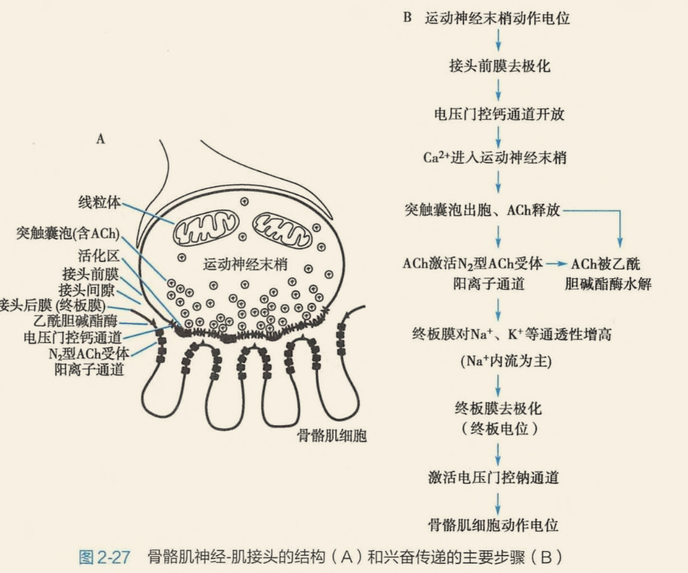
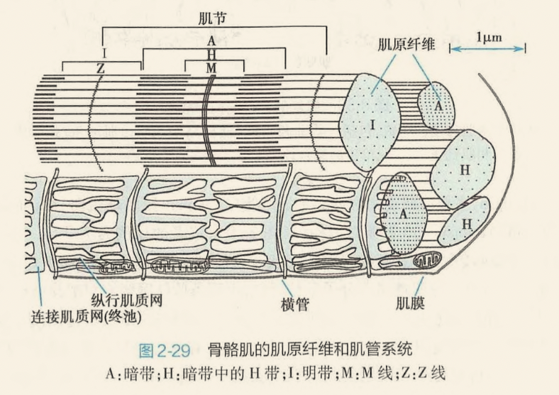
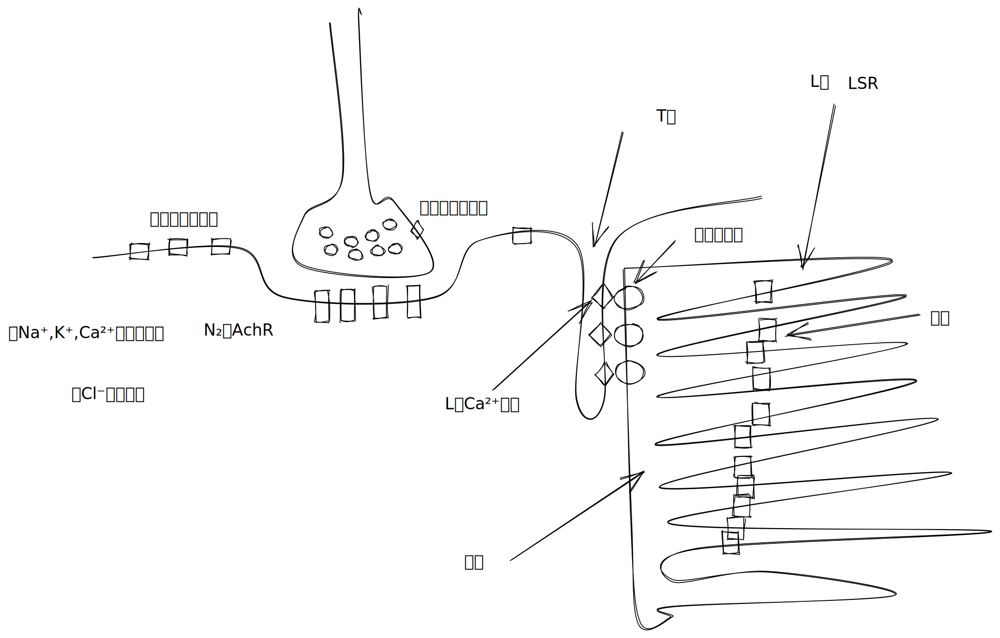
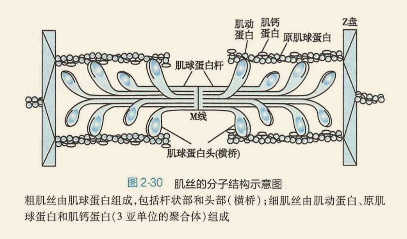
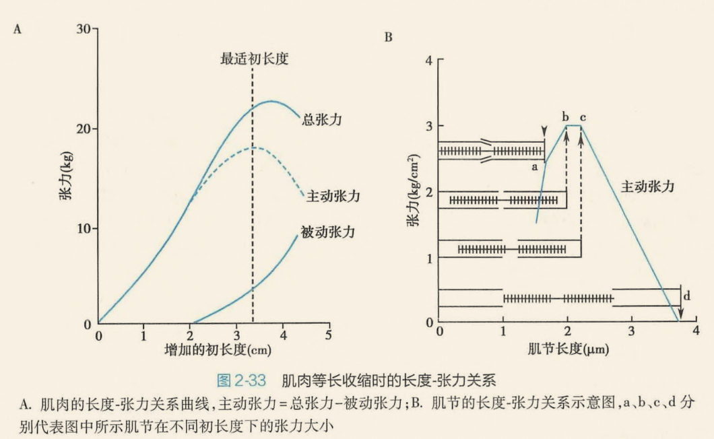
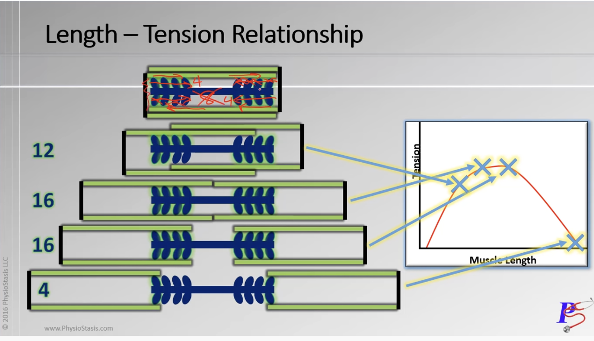

- [[et cetera]]
	- 骨骼肌神经-肌接头处的兴奋传递
	  collapsed:: true
		- 突触
			- 前膜
				- 电压门控钙通道
				- 囊泡内有很多 [[Ach]]
			- 间隙: 充填细胞外液(易受影响)
			- 后膜(终板膜):许多 [[N₂-AchR]]
				- {{embed ((622b477a-f1ad-4d34-82c0-f22d8ff1fbc4))}}
				- 
				- {{embed ((622b4634-dc29-44e9-8215-afa31a9902b5))}}
					- [[新斯的明]]可逆性抑制治疗[[重症肌无力]],[[有机磷农药]]不可逆使其磷酸化而失活
					- [[N₂-AchR]]的阻断剂 [[筒箭毒碱]],[[α-银环毒素]]
						- [[外科学]]
							- ||[[筒箭毒碱]] (竞争性肌松药)|[[琥珀胆碱]](非竞争性肌松药)|
							  |机制|阻断 [[N₂-AchR]]|持续激动 [[N₂-AchR]]无法被 [[乙酰胆碱酯酶]]降解 |
							  |解救|用 [[新斯的明]]解救|无法用 [[新斯的明]]治疗|
					- [[强直后增强]]
						- {{embed ((622b4d2d-0ee8-4d16-abfc-ee77101641e7))}}
						- 钙离子持续流入
	- 横纹肌的结构特征
		- 
		- [[T管]]:将兴奋传导到细胞内部
			- {{embed ((622b50e7-57e3-47b6-9214-61cc01daa086))}}
		- [[L管]]
			- [[LSR]]:膜上有[[钙泵]],可逆浓度将胞质中Ca²⁺转运至SR内
			- [[JSR]]:Ca²⁺浓度比胞质高万倍,膜中嵌有钙释放通道或称[[雷诺丁受体]]:分布与[[T管]]或肌膜上的[[L型钙通道]]相对应
		- {:height 465, :width 716}
	- 横纹肌细胞的收缩机制
		- [[肌丝滑行理论]]:将明带往暗带里塞,A带不变,I与H带变短 {{embed ((622b639e-a8b8-4eca-8adf-e0bbd8a3ebcc))}}
		- 肌丝的分子结构
			-  [[Comments]]:提到[[肌球蛋白]]应该立马想到这个图
			- 粗肌丝: [[肌球蛋白]]
			- 细肌丝: [[肌动蛋白]],[[原肌球蛋白]]:双链长度相当于7个[[肌动蛋白]],[[肌钙蛋白]]
			  {{embed ((622b5ce0-ecc4-4b66-ae7c-0fb1f623d927))}}
		- 肌丝的滑行过程
			- 通过横桥周期完成,结合ATP后分解释放能量,使横桥离开肌动蛋白复位,同时于ADP结合而出于高势能高亲和力状态
			- ((622c2f29-40f0-4fac-995f-e1b813aa1543))
	- 横纹肌细胞的兴奋-收缩耦联
		- 兴奋-收缩耦联的基本步骤
			- 神经肌接头使骨骼肌细胞膜发生兴奋→兴奋沿 [[T管]]传至细胞深处→激活T管膜的 [[L型钙通道]]→ [[L型钙通道]]变构(拔塞样作用)→激活终池 [[雷诺丁受体]]→$\xrightarrow[]{终池Ca²⁺释放}$Ca²⁺结合 [[肌钙蛋白]]引起骨骼肌收缩→肌浆内钙被纵行肌浆网[[钙泵]]回收$\xrightarrow[]{肌浆内Ca²⁺浓度下降}$骨骼肌舒张
			  
			- 骨骼肌[[兴奋-收缩耦联]]注意事项
				- 兴奋收缩耦联包含舒张过程,舒张过程要耗能
					- [[串联]]: [[冠心病]]早期→心肌缺血能量↓→心肌肌浆内的Ca²⁺不能及时处理→心室主动舒张障碍
				- 骨骼肌和心肌的差异
					- 兴奋沿T管传至细胞深处传至细胞深处激活肌膜和T管膜上的 [[L型钙通道]]$$\begin{cases}\begin{rcases}骨骼肌:L型钙通道变构(拔塞样作用)\\心肌:L型钙通道开放(钙触发的钙释放)\end{rcases}\end{cases}$$激活终池([[JSR]])的 [[雷诺丁受体]]→终池向肌浆顺浓度释放Ca²⁺使得肌浆内Ca²⁺升高Ca²⁺结合肌钙蛋白引起肌肉收缩$\begin{cases}骨骼肌:100\%被回收进入终池\\心肌:80\%-90\%钙被纵行肌浆网回收,10\%到-20\%被肌膜上的钙泵和钠-钙交换排出细胞外\end{cases}$
					- [[串联]]心肌:临床使用 [[CCB]]后骨骼肌收缩不被抑制(因为其不需要打开,只需单纯拔塞)而心肌可被抑制
	- 影响横纹肌细胞收缩效能的因素
	  collapsed:: true
		- ((622c309c-04d1-4458-9e7b-62b002589090))
		- 前负荷
			- 是指肌肉在收缩前所承受的负荷
			- 
			  
		- 后负荷
			- ((622c3181-71c4-4a8b-85c2-9d5d4034c058))
		- 肌肉收缩能力
			- 增强心肌收缩能力,长度-张力曲线上移动,张力-速度关系曲线右上移
		- 收缩的总和
			- ((622c337e-55ff-4faf-9069-742976972ecb))
			- 多纤维总和
				- ((622c33a6-6ad2-428e-b27f-25988b26f29e))
				- ((622c33f6-7080-40e4-9c60-e3f11b2eacd1))
			- 频率总和
				- {{embed ((622c3428-91c2-49e5-b896-baaf7562dbc8))}}
- 肌细胞的收缩
	- 分类
		- 横纹肌
			- 骨骼肌 --- 随意肌 ← 运动N 脊髓前角α神经元
			- 心肌 --- 非随意肌 ← 自主N {交感N,副交感神经(迷走神经)}
		- ~~平滑肌~~ 考纲不要求
		  ** 肌管系统
		  *** 横管 T 管将肌c表面的AP传到肌c深部
		  *** 纵管 ((61decce3-a0c8-4dd7-950c-ee38c899169e))
		  **** [[../assets/image_1641991306322_0.png]]
		  **** 连接两端(终池) 钙通道/雷诺丁受体→Ca²⁺释放
		  **** 纵行肌浆网:钙泵→Ca²⁺回收
		  ** 横纹肌细胞的收缩机制
		  *** 肌丝滑行 ((61ded316-5bec-42d5-9a09-366ce37ac28f))
		  **** 不变: 暗带,肌丝本身的长度
		  **** 变短: 明带,H带
		  **** [[../assets/image_1641993575760_0.png]]
		  *** 肌原纤维 ((61ded3da-e8cd-42ef-b5e3-60e519731503))
		  **** 粗肌丝: 肌球(凝)蛋白 横桥具有ATP酶活性
		  **** 细肌丝
		  ***** 肌动蛋白: 横桥结合位点
		  ***** 原肌球蛋白: 覆盖和阻碍肌球蛋白与肌钙蛋白结合
		  **** [[../assets/image_1641993345135_0.png]]
		  *** 骨骼肌与心肌的对比
		  id:: 61ded5c2-05e5-493e-a25b-021951494971
		  **** [[../assets/image_1641993835363_0.png]]
- [[Comments]]
  collapsed:: true
	- [[Jan 12th, 2022]]
		- ((61ded5c2-05e5-493e-a25b-021951494971))
			- 或许我应该重新打一次
* [[生理学医考帮考研真题]]
*